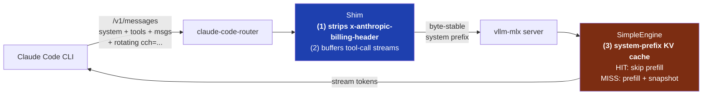

> **Update (2026-05-14).** The SimpleEngine prefix-cache patch described in
> Finding #2 is now upstream as
> [vllm-mlx PR #523](https://github.com/waybarrios/vllm-mlx/pull/523), merged.
> If you're on a recent vllm-mlx build, the fix is already there — no local
> patching required. The walk-through below is still useful for understanding
> what the patch does and why it was needed.
{: .prompt-info }

> **Update (2026-05-18) — two more sharp edges if you're running this for real:**
>
> 1. **Don't use strict `json_schema` response_format against sparse-MoE Coder
>    models.** If you also run LangChain (or any OpenAI-compatible client) with
>    structured outputs against the same vllm-mlx instance, prefer
>    `with_structured_output(schema, method="json_mode")` over the LangChain
>    default `"json_schema"`. The strict path triggers grammar-constrained
>    decoding which has hung on Qwen3-Coder-30B-A3B for 5+ minutes per call —
>    and a wedged decoder starves every queued request, including your Claude
>    Code session, until the server restarts. Filed upstream as
>    [vllm-mlx#546](https://github.com/waybarrios/vllm-mlx/issues/546).
>
> 2. **PR #523 fixes the single-slot system-KV cache. You probably also want a
>    multi-slot variant.** Claude Code sub-agents (Explore, Plan,
>    general-purpose) carry different tool sets, so each one's system prefix
>    differs from the main agent's. With a single-slot snapshot, every
>    sub-agent dispatch evicts the main agent's cache and vice versa, and you
>    pay the full ~28K-token cold prefill every turn. The multi-slot LRU
>    follow-up is local for now — upstream PR pending.
{: .prompt-warning }

## TL;DR

I run [Claude Code](https://docs.anthropic.com/claude/docs/claude-code) against a
self-hosted [vllm-mlx](https://github.com/waybarrios/vllm-mlx) backend on a Mac
Studio. Cold turns took ~108 seconds. Follow-ups took *almost the same*, even
though the system prompt was byte-stable and any LLM engine worth its salt should
be caching the prefix.

Two findings, **both required** to get the speedup:

1. **Claude Code injects a rotating `x-anthropic-billing-header` value into the
   system block on every turn.** Even though the user-visible system prompt
   doesn't change, the bytes the engine hashes for cache lookup *do* change every
   request. The prefix cache misses 100% of the time. Strip the header at the
   proxy layer and the cache becomes useful.
2. **vllm-mlx's `SimpleEngine` doesn't carry KV state across requests.** Even with
   the rotating header gone, you have to patch SimpleEngine to actually *cache*
   the system prefix between turns — a small single-slot, hash-keyed cache that
   restores the snapshot on a hit and prefills only the suffix.

Together: **108-second turns → 7-8 second follow-ups. A 13-15× speedup**, on the
same hardware, with the same model.

<div class="tldr-cards">
<div class="tldr-card"><span class="tldr-num">108s → 7-8s</span><span class="tldr-sub">warm-turn wall-clock, before vs after</span></div>
<div class="tldr-card"><span class="tldr-num">13-15×</span><span class="tldr-sub">follow-up speedup, same hardware + model</span></div>
<div class="tldr-card"><span class="tldr-num">81 bytes</span><span class="tldr-sub">of rotating header text that was costing 100+s/turn</span></div>
</div>

## The setup



The three numbered points are where the speedup comes from. Strip (1) and (3)
and you're back to 100+ second turns.


- Backend: vllm-mlx serving `Qwen2.5-Coder-32B-Instruct-8bit` on a Mac Studio (96 GB).
- Front door: a small FastAPI shim that exposes Anthropic's `/v1/messages` API and proxies to vllm-mlx.
- Routing: [`claude-code-router`](https://github.com/musistudio/claude-code-router) translates Claude Code's outbound calls to the shim's URL with a bearer token.
- Client: Claude Code, the CLI.

End-to-end the architecture worked. Tool calling worked. Streaming worked. Output
quality was fine. It was just *slow* — and slow in a way that didn't match how any
of this is supposed to behave.

For context: Claude Code's prompts are large. Measured across captured requests
on this setup, the cacheable prefix — Claude Code's system instructions plus the
tool-definitions block — runs around **23,000 tokens** (≈5.6K system + ≈17.6K
tools, for a 23-tool toolset). With a working prefix cache, only the new user
message and the conversation tail need to be processed each turn — typically a
few hundred tokens. Without one, the engine re-prefills ~23K tokens every.
single. turn. On a 32K-context model, that leaves about 9K headroom for the
conversation and output, which is fine — but only if you're not throwing away the
prefix work each turn.

## What I expected vs what I observed

|                                  | Cold turn | Warm turn |
| -------------------------------- | --------- | --------- |
| Stock vllm-mlx, no shim          | 108 s     | ~100 s    |
| Shim strips billing header only  | 105 s     | ~70 s     |
| Shim strips header + SimpleEngine KV-cache patch | 108 s     | **7-8 s** |

The cold-turn number doesn't change — there's no cache to hit on the first
request. The warm-turn delta is the whole story.

## Finding #1: the rotating billing header

The first useful diagnostic was diffing the raw bytes of two consecutive
`/v1/messages` requests from Claude Code. Almost everything was identical: system
prompt, tool definitions, conversation history, sampling params. But there was
one block in the system list that changed every turn:

```
{"type": "text",
 "text": "x-anthropic-billing-header: cc_version=...; cc_entrypoint=cli; cch=<rotating-hash>"}
```

Claude Code injects this. The `cch=` value rotates per request — Anthropic uses
it for billing and conversation tracking. On Anthropic's hosted API, the cache
layer normalizes around it and there's no impact. On a self-hosted backend that
simply hashes the prompt as-is, **the rotating value invalidates the cache key on
every request.** Every turn looks brand new to the engine, because every turn
*is* brand new.

The fix at the shim is a one-function filter:

```python
def _strip_billing_header(payload: dict) -> None:
    """Drop Claude Code's `x-anthropic-billing-header` system block.

    Claude Code injects a small system block of the form
    `x-anthropic-billing-header: cc_version=...; cc_entrypoint=cli; cch=<hash>`
    whose `cch` value rotates every turn. Anthropic's cloud uses it for billing
    tracking; local upstreams just see it as 81 bytes of system text. With our
    SimpleEngine prefix-KV cache, that rotating field changes the system-prefix
    hash each turn → every turn is a cache miss → 100s+ prefill on the
    ~23K-token system+tools prefix. Removing this block makes the system
    prefix byte-stable turn-over-turn so the cache actually hits.
    """
    system = payload.get("system")
    if not isinstance(system, list):
        return
    payload["system"] = [
        b for b in system
        if not (
            isinstance(b, dict)
            and isinstance(b.get("text"), str)
            and b["text"].lstrip().lower().startswith("x-anthropic-billing-header")
        )
    ]
```

81 bytes of rotating text was costing 100+ seconds per turn. Not a great trade.

> **Note.** vllm-mlx PR #277 quietly does the same fix for the `/v1/messages`
> endpoint. If you're on a recent build of vllm-mlx and using its native
> Anthropic adapter, you may already be covered. I run my own shim (for tool-call
> buffering on the Coder alias — vllm-mlx's Hermes parser streams tool JSON as
> content deltas, which doesn't round-trip cleanly to clients), so I had to
> strip the header myself.
{: .prompt-info }

After this fix, warm turns dropped from ~100 s to ~70 s. A real win, but the
prefix cache *should* have been saving 95+ seconds, not 30. So either the cache
wasn't engaging at all, or it was engaging only partially. Onward.

## Finding #2: SimpleEngine wasn't actually caching the prefix

vllm-mlx ships two engines — both MLX-native, neither is upstream vLLM's
PagedAttention/CUDA core (which doesn't run on Apple Silicon at all).
`engine/simple.py` is *"Simple engine for maximum single-user throughput.
Wraps mlx-lm directly with zero overhead for optimal performance when serving
a single user at a time."* `engine/batched.py` is *"Batched engine for
continuous batching with multiple concurrent users."* For a single-user
Claude Code session, SimpleEngine is the right pick — no scheduler, no
batching wait, direct access to mlx-lm's prompt cache. BatchedEngine wins
when multiple users hit the same backend concurrently.

SimpleEngine was what I was using. Profiling showed prefill running across the
full system + tool prefix on every turn, even after the billing header was
gone. The cache hit rate was effectively zero.

The reason: SimpleEngine's request handler doesn't carry KV state from the
previous request to the next. Each request gets a fresh prompt cache via
`make_prompt_cache(model)` and prefills the whole prompt from scratch. There's
no across-requests cache to hit — the prefix cache lives only inside a single
request.

The fix was a small patch: add a **single-slot, hash-keyed system-prefix KV
cache** to SimpleEngine. Detect the system prefix using the ChatML markers that
delimit it, hash the prefix tokens, and:

- On a **hit**, restore the saved KV snapshot and prefill only the suffix.
- On a **miss**, prefill the system prefix in chunks, snapshot the resulting KV
  state, and store it (overwriting the previous slot).

```python
# Excerpt from system_kv_cache_for_simple_engine.patch — a few of the load-bearing lines.

system_hash = hashlib.sha256(system_prefix_text.encode()).hexdigest()[:16]

# ...
if (
    system_hash == self._system_kv_hash
    and self._system_kv_snapshot is not None
    and system_token_count == self._system_kv_token_count
):
    cache_hit = True
    logger.info("System KV cache HIT: reusing %d tokens, prefilling %d new (hash=%s)",
                system_token_count, len(suffix_tokens), system_hash)
else:
    logger.info("System KV cache MISS: will prefill %d system + %d suffix tokens (hash=%s)",
                system_token_count, len(suffix_tokens), system_hash)

# On HIT, restore the saved cache state and skip system prefill:
if cache_hit:
    bc = make_prompt_cache(model)
    for i, saved_state in enumerate(self._system_kv_snapshot):
        bc[i].state = saved_state

# On MISS, prefill the system prefix in chunks, then snapshot:
else:
    # ... chunked prefill of system_tokens ...
    self._system_kv_snapshot = [c.state for c in bc]
    self._system_kv_hash = system_hash
    self._system_kv_token_count = system_token_count
```

A few design choices that mattered:

- **Single slot, not LRU.** A Claude Code session has one conversation at a time,
  so multi-slot is overkill. The slot just stores `(hash, snapshot, token_count)`
  and overwrites on miss.
- **Hash the prefix only, not the full prompt.** That way the cache survives new
  user messages on the tail end — which is the common case.
- **ChatML marker detection.** The boundary between system and user is found by
  searching the rendered prompt for `<|im_start|>user\n` or
  `<|im_start|>assistant\n`. If neither marker is found, fall back to the
  uncached path and don't break.
- **Safe fallback on any exception.** If the cache-aware path fails for any
  reason, log a warning and fall back to the original `stream_generate`. Don't
  let a perf optimization take down generation.

The full patch is upstream as
[vllm-mlx PR #523](https://github.com/waybarrios/vllm-mlx/pull/523). Review
hardened the original cut: closure-local capture at the gate to close a
TOCTOU race against the snapshot pointer, and an init-time probe that disables
the cache for sliding-window models whose `RotatingKVCache` aliases buffers the
engine mutates in place. The merged code is the right reference to read if
you're curious about the cache mechanics.

## The numbers

After both fixes were in place, warm-turn wall-clock dropped from ~70 s
(billing-header fix alone) to **7-8 s** (billing-header fix + SimpleEngine KV
cache). The cold turn is unchanged — there's no prior turn to cache against on
the first request — but the cache hit rate from turn 2 onward is essentially
100%, and the speedup is large enough that Claude Code becomes interactive
instead of glacial.

## What I'd do differently

**Diff the inputs before profiling the engine.** The billing header would have
fallen out of a 30-second `diff` of two consecutive request bodies. I didn't run
that diff for far too long — I was looking at vllm-mlx internals, profiling
prefill, reading mlx-lm cache code, anything *but* the actual bytes going over
the wire. Once I finally did the diff, the rotating `cch=` value was on the
screen in five minutes.

That has become a personal rule for any latency mystery on a black-box stack:
**capture two consecutive requests, diff them, look at what's *not* stable
before assuming the engine is misbehaving.** It would have saved me an evening
on this one and I suspect it'll save me more.

The second thing I'd change: the SimpleEngine cache patch should have come
*after* I'd quantified what the billing-header strip alone bought me. I lumped
both fixes in the same session, which made it harder to attribute the speedup
cleanly. The numbers in this post are reconstructed from a follow-up
measurement; if I'd been disciplined the first time, I'd have had them ready.

## When you'd hit this

You'll hit some version of this if you:

- Self-host an Anthropic-compatible LLM backend (vllm-mlx, llama.cpp's Anthropic
  adapter, a custom shim, etc.) and point Claude Code or another Anthropic-protocol
  client at it.
- Notice that warm turns aren't faster than cold turns even though your system
  prompt is byte-stable.
- See the engine's prefill phase running across the full prompt every turn in
  profiling.

If you're using Anthropic's hosted API, none of this applies — the platform
handles the billing header and prefix caching transparently.

## Reproducing this

The two pieces that make the speedup happen:

- **Billing-header strip** — about 15 lines of FastAPI shim code that filter the
  rotating `x-anthropic-billing-header` block out of the system list before the
  payload reaches vllm-mlx. Identical logic to what
  [vllm-mlx PR #277](https://github.com/waybarrios/vllm-mlx/pull/277) does
  natively on the `/v1/messages` adapter; you only need a shim if you're not on
  that path.
- **SimpleEngine prefix-cache** — now upstream as
  [vllm-mlx PR #523](https://github.com/waybarrios/vllm-mlx/pull/523). Read the
  merged code if you want the cache mechanics; the load-bearing logic is the
  hash check, the snapshot capture on miss, and the safe fallback when the
  detection fails.

## Credits

[vllm-mlx PR #277](https://github.com/waybarrios/vllm-mlx/pull/277) found the
billing-header issue independently for the `/v1/messages` endpoint. If you're
using vllm-mlx's native Anthropic adapter rather than your own shim, that's the
right upstream fix. The SimpleEngine prefix-cache patch landed in
[vllm-mlx PR #523](https://github.com/waybarrios/vllm-mlx/pull/523) — thanks to
the maintainers for the review, which improved the patch in two specific ways
(closure-local capture against a TOCTOU on the snapshot pointer, and a
sliding-window guard for `RotatingKVCache`).

---

*If you've hit this too, or your self-hosted Claude Code setup is slow for a
different reason I haven't found yet, I'd love to hear about it — reach me on
[LinkedIn](https://www.linkedin.com/in/vinay-vobbilichetty) or by
[email](mailto:vinayvobbilichetty11@gmail.com).*
