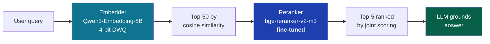

## TL;DR

Our SOC's RAG pipeline retrieves over 142,000 closed XSOAR security tickets to ground
investigation answers. After exhausting the easy wins — chunking, top-k, reranker
choice — we still saw the right historical ticket land at rank 5-10 too often, and
the LLM grounding its answer in a near-miss neighbor.

We fine-tuned the reranker on our own data. Held-out test set, time-based split:

|                              | MRR@10  |
| ---------------------------- | ------- |
| `BAAI/bge-reranker-v2-m3` (off-the-shelf) | 0.598   |
| Fine-tuned on 24K XSOAR pairs              | **0.846** |

**+41% uplift.** No model architecture change, no embedding model swap. Just
domain-specific fine-tuning of the same base reranker.

<table>
<tr>
<td align="center" width="33%"><h2>+41%</h2><sub>MRR@10 uplift on held-out time-split test set</sub></td>
<td align="center" width="33%"><h2>24,213 + 10,848</h2><sub>positive pairs + clean hard negatives, mined from close-notes</sub></td>
<td align="center" width="33%"><h2>0</h2><sub>explicit relevance labels collected — all signal mined from existing analyst text</sub></td>
</tr>
</table>

The interesting part isn't the result — it's where the training data came from. We
never logged a single explicit relevance judgement. The 24K positive pairs were
hiding in plain sight inside analyst close-notes that nobody asked anyone to write.

## The setup: embedder + reranker, the standard two-stage RAG




Our retrieval pipeline is the standard cascade:

- **Stage 1 — Embedder (bi-encoder).** `Qwen3-Embedding-8B-4bit-DWQ` served via
  vllm-mlx. Encodes the query independently, pulls top-50 candidates from ChromaDB
  by cosine similarity. Fast, but it scores query and document in isolation.
- **Stage 2 — Reranker (cross-encoder).** `BAAI/bge-reranker-v2-m3` running on
  Apple Silicon (MPS). Jointly attends over `(query, document)` and re-scores the
  top-50 down to top-5 to feed the LLM. Slower per item, but dramatically more
  accurate than embedder-only ranking.

Mental model: the embedder is a fast librarian who pulls 50 books off the shelf
based on title similarity. The reranker is a careful reader who actually opens each
one and re-orders by relevance to your specific question.

Off-the-shelf rerankers like `bge-reranker-v2-m3` are trained on general English
passage retrieval (MS MARCO and friends). They've never seen an XSOAR ticket. They
don't know that *"INBLRPRDDKNF01: ML via Cloud-based ML"* matters in a way that
generic English semantic similarity cannot capture. Fine-tuning is how you teach
them.

## Where the training data came from

Cross-encoder training needs `(query, positive, negative)` triples. We had no
explicit relevance labels — no clicks, no thumbs-up/down, nothing. So we mined
implicit ones from analyst close-notes.

Buried in 142,000 closed tickets are sentences analysts type all the time:

- *"With reference to XSOAR #289008, regional team confirmed..."*
- *"Refer master ticket #158126."*
- *"Per XSOAR #463428, user confirmed..."*

Each one is a human-curated link between two tickets. Free relevance label. We just
had to extract them.

> **Generalizable lesson.** Before paying for labels, look at what your users are
> already typing. Free-form text in close-notes, comments, JIRA descriptions —
> they're full of implicit relevance judgements that nobody asked anyone to record.
{: .prompt-tip }

### Filtering the noise: not all `#N` references are equal

A regex over close-notes pulled 61,500 `#N` references. Most were useless:

| Pool | Lead-in phrase            | Count   | Signal quality                                                  |
| ---- | ------------------------- | ------- | --------------------------------------------------------------- |
| A    | *"Duplicate to #N"*       | 52,782  | Strong but trivial — same alert, different host. Embedder already gets these. |
| B    | *"XSOAR #N · Per XSOAR…"* | ~3,000  | **Gold** — analyst-curated cross-references between distinct tickets.            |
| —    | *"QRadar offense #N"*     | ~1,400  | Useless — references other systems, not XSOAR.                  |

Pool A is mostly the embedder's home turf already; the reranker doesn't need help
with near-duplicates. Pool B is the interesting signal: *"these two tickets are
related but not identical"* — exactly the case where a reranker earns its keep.
After regex-filtering and verifying both endpoints existed in our DB, we had **4,260
unique direct `(src → tgt)` pairs.**

## Free positives via transitive siblings (and the polynomial-blow-up trap)

When five tickets all cite the same master ticket, those five are also related to
each other. That's a free `O(n²)` inflation of training pairs — *if* you cap the
explosion.

We capped each master at 20 children before generating siblings. One particularly
prolific master had 553 children; ungapped, it would have generated **~150,000
trivial sibling pairs** and dominated the training distribution. Stratified sampling
across distinct rules pushed cross-rule pairs to the front so the model learned
*generalizable* relations, not within-rule sameness.

| Source                                      | Count  |
| ------------------------------------------- | ------ |
| Direct `#N` references                      | 4,260  |
| Transitive siblings (capped, stratified)    | 19,953 |
| **Total positives (training-ready)**         | **24,213** |

72% of the transitive pairs were cross-rule — a strong signal that our cap +
sampling worked.

> **Generalizable lesson.** Any time you derive new training examples by
> transitivity (or any structural inference), watch for polynomial blow-up in dense
> clusters. Stratified sampling is usually the right counter-move.
{: .prompt-tip }

## The part most beginners get wrong: hard negative mining

Negatives matter as much as positives. The model learns from contrast, and *random*
negatives teach almost nothing — they're already obviously different. The interesting
negatives are the ones that *look* similar to the embedder but aren't actually
related. Those are the cases the embedder gets wrong, and they're exactly what the
reranker needs to learn to push apart.

The recipe: for each source ticket, query the existing embedding index for the
top-50 nearest neighbors. Drop anything that's a known positive (direct, transitive,
or shares a master). What's left is what the embedder thinks matches but the analyst
never linked — *hard negatives*.

We caught a subtle trap on the first run: **same-rule near-duplicates are not hard
negatives.** Two tickets both fired by `INBLRPRDDKNF01: ML via Cloud-based ML` with
0.997 cosine similarity are sibling alerts of the same automated detection rule —
they're related, just not via an analyst's `#N` reference. Training on them as
negatives would teach the model to push apart things that are actually related.
Filtering by rule before adding to the negatives pool dropped 33% of candidates.

| Stage                                          | Count   |
| ---------------------------------------------- | ------- |
| Raw top-50 candidates from embedder            | 16,137  |
| Same-rule contamination (filtered out)         | 5,289 (33%) |
| **Clean cross-rule hard negatives**            | **10,848** |

Median cosine similarity of the kept negatives: 0.955 — i.e. the embedder
*strongly* believed these were relevant. They weren't. That's exactly the gap a
reranker should close.

## Data discipline: split by time, never by random

Random train/val/test splits leak future signal into training and lie to you about
held-out quality. Any time your data has a time dimension — fraud, security, sales
forecasting, almost everything in production ML — split by time. In production the
model can never look at the future, so neither should your evaluation.

| Split | Date range              | Rows   | Pos / Neg     |
| ----- | ----------------------- | ------ | ------------- |
| Train | before 2025-09-01       | 27,604 | 18,745 / 8,859 |
| Val   | 2025-09 to 2025-11      | 3,122  | 2,378 / 744   |
| Test  | 2025-12 onward          | 4,335  | 3,090 / 1,245 |

## The part that's almost a one-liner: the training loop

After all the data work, the actual fit is short:

```python
from sentence_transformers import CrossEncoder, InputExample
from torch.utils.data import DataLoader

model = CrossEncoder(
    "BAAI/bge-reranker-v2-m3",
    num_labels=1,
    max_length=512,
    device="mps",
)

examples = [
    InputExample(texts=[r["query"], r["passage"]], label=float(r["label"]))
    for r in load_jsonl("train.jsonl")
]
loader = DataLoader(examples, shuffle=True, batch_size=8)

model.fit(
    train_dataloader=loader,
    evaluator=evaluator,
    epochs=2,
    warmup_steps=int(len(loader) * 2 * 0.1),
    optimizer_params={"lr": 2e-5},
    output_path="checkpoint",
)
```

A few details that mattered:

- **BCE-with-logits loss** on `(query, passage, label ∈ {0, 1})`. Single-score output, binary cross-entropy.
- **AdamW at `lr=2e-5`** — the standard learning rate for BERT-family fine-tunes. Don't overthink it.
- **Linear warmup for the first 10%** of steps (LR ramps 0 → 2e-5), then linear decay back to 0. Prevents unstable updates early when the model is still learning the new label distribution.
- **Periodic val evaluation** every ~862 steps. We tracked Average Precision to know when to stop.

## The payoff

|                       | Baseline MRR@10 | Fine-tuned MRR@10 | Δ      |
| --------------------- | --------------- | ----------------- | ------ |
| Validation            | 0.626           | 0.811             | **+30%** |
| **Test (held-out time)** | **0.598**       | **0.846**         | **+41%** |

MRR@10 is the standard ranking metric: for each query, find the rank of the first
relevant result; if it's at rank *k*, score is *1/k*; average across queries. Our
baseline 0.598 means the first relevant ticket lands at rank ~1.7 on average. Our
fine-tuned 0.846 means it lands at rank ~1.18 — almost always at the top.

Translation: the LLM grounds its answer on the right historical ticket *almost every
time* now. It's not a marginal improvement — it changes whether the agent's
suggestion is *useful* or *plausible-but-wrong*.

## Battle scars (the gotchas nobody documents)

A few things I had to fix while getting this to actually run:

**Corp SSL.** The Mac running training had the corporate CA trusted at the system
level (so `curl` and the OS Keychain were happy), but Python's `requests` /
`urllib3` use `certifi`'s CA bundle, *not* the system store. So `pip install` and
HuggingFace model downloads failed with `CERTIFICATE_VERIFY_FAILED`. The fix is to
build a combined CA bundle and point both env vars at it (different libraries read
different ones):

```bash
export REQUESTS_CA_BUNDLE=~/corp-ca-bundle.pem
export SSL_CERT_FILE=~/corp-ca-bundle.pem
```

**Embedding model name enforcement.** vllm-mlx serves on a fixed model ID and
422s any request with the wrong name. The default `text-embedding-ada-002` fallback
in some libraries doesn't match. Set `EMBEDDING_MODEL` explicitly *before* the
embedding function is imported — production systemd loads it via `EnvironmentFile`,
ad-hoc scripts have to source `.env` themselves.

**MPS memory accounting.** PyTorch's MPS allocator counts macOS file cache and
inactive pages as *"other allocations"* — even though those pages are reclaimable.
With another 32B model already loaded, training OOMed at 19GB MPS allocation
despite 88GB physically free. The fix is unsafe-by-default but usually correct:

```bash
export PYTORCH_MPS_HIGH_WATERMARK_RATIO=0.0
```

This disables the watermark check. Safe *if* you've actually verified there's free
memory (`vm_stat` first). On a system where physical RAM is genuinely exhausted,
this will crash macOS.

**`launchctl` quirks.** macOS service management is a footgun farm: `launchctl
unload` is deprecated; `bootout` sometimes returns I/O error from `gui/UID` but
works from `user/UID`; `KeepAlive=true` respawns killed processes — you must
remove the service from launchd, not just kill it. Lost an evening to this once.

## When you'd consider doing this

- You have a domain corpus where "relevant" means something specific (legal,
  medical, security tickets, internal company docs) — generic English passage
  retrieval doesn't capture your relevance signal.
- You have an implicit relevance signal somewhere — clicks, links, analyst
  references, ticket relationships, support-case "see also" — that you can mine.
- A stock reranker is already in your pipeline and you've tuned chunking + top-k
  and you're out of obvious wins.
- You have a few thousand to a few tens-of-thousands of pairs — you don't need
  millions.

## What surprised me

A few things, in order of how much they surprised me:

**The hard-negative filter mattered more than the positive-pair mining.** The
+41% lift would have collapsed to "modestly better than baseline" if I'd kept
those 33% same-rule near-duplicates in the negatives pool. The model would have
spent its capacity learning to push apart things that are actually related and
gotten worse at the real job. The data-quality work was disproportionately
high-leverage; the training loop itself was almost incidental.

**The held-out test MRR (0.846) was *higher* than the validation MRR (0.811).**
That's backwards from the usual story where test is the hardest split. My read:
detection rules in late 2025 / early 2026 are slightly clearer-cut than the
mid-2025 rules in the val window, so the test queries were genuinely easier.
Worth a deeper look, but it's also a useful sanity check — the model is
generalizing forward in time, not memorizing.

**bge-reranker-v2-m3 at 0.598 baseline is surprisingly OK** for a model that has
never seen a security ticket. Off-the-shelf rerankers are stronger out-of-domain
than I expected. That's both reassuring (you can ship a reasonable RAG without
fine-tuning) and a trap (you can ship a *reasonable* RAG without fine-tuning,
and it'll feel "good enough" until you measure properly).

## What I'd do differently

**Build the eval harness on day 1.** I spent too long tuning chunking and top-k
by vibes before I had a number to optimize against. Once the MRR@10 harness
existed, every change was a one-command before/after — and most of the
"improvements" I'd been making earlier turned out to be wash trades. The harness
took an afternoon to build. I would have saved a couple of weeks by starting
there.

---

*Reproducing this is doable in a couple of days if you have a domain corpus with
implicit relevance signal. If you've tried this on your own data, or hit a snag I
didn't, I'd love to hear how it went — reach me on
[LinkedIn](https://www.linkedin.com/in/vinay-vobbilichetty) or by
[email](mailto:vinayvobbilichetty11@gmail.com).*
