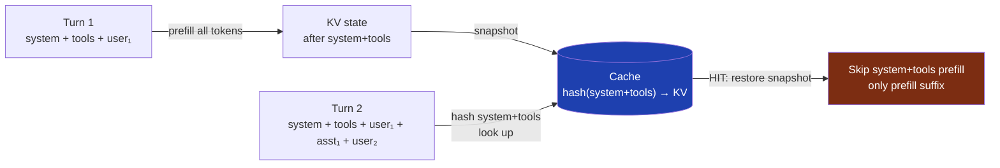

## TL;DR

A 30B coder model behind a self-hosted Claude Code setup went from **~8 seconds to first token → effectively instant** on follow-up turns. Same hardware. Same model weights. Same prompt. The fix wasn't in the engine — it was in the chat template.

Prompt caching only works if the **unchanged prefix of the conversation renders to byte-identical text** between turns. Three Jinja2 patterns inside chat templates silently break that property. None of them are bugs — they're useful features for *generation*. They're just incompatible with prefix-KV caching.

<table>
<tr>
<td align="center" width="33%"><h2>3 patterns</h2><sub>that quietly invalidate a prefix-KV cache turn-over-turn</sub></td>
<td align="center" width="33%"><h2>~25 MB</h2><sub>system+tools KV snapshot for a 30B coder on 8-bit MLX</sub></td>
<td align="center" width="33%"><h2>~13×</h2><sub>warm-turn speedup once the cache actually hits</sub></td>
</tr>
</table>

Run the check below against any model's published `tokenizer_config.json` **before** you download the weights. It takes five minutes and a Python interpreter.

## Why prefix caching is so fragile

A prefix-KV cache works like this:



The engine hashes the *bytes* of the rendered prompt up to some boundary (typically end-of-system or end-of-tools), looks the hash up, and on a hit restores the saved KV state and prefills only the new suffix.

The contract: **the bytes the template emits for the unchanged part of the conversation must not change between turns.** Sounds obvious. It often isn't.

A Hugging Face chat template is a Jinja2 file that takes a list of messages and a tool list, and emits the model-specific prompt format. Some templates render previous turns *differently* depending on what comes after them. When that happens, the prefix isn't a prefix anymore — it's a function of the whole conversation. Cache misses every turn.

## Pattern 1: `last_query_index` retroactive rewrites

Several Llama 3+ derivatives use a pattern like:

```jinja


    
        {{ "<|special_marker|>" + message.content }}
    
        {{ message.content }}
    

```

The intent is reasonable: emit a special marker on the most recent user message so the model knows where to start answering. The problem: when a new turn arrives, `last_query_index` moves forward. The message that *was* the last query is now rendered without the marker, and the message that's newly last gets the marker added.

Net effect: the byte at position N where the old marker used to be is now plain text. Every byte after that position is also shifted. The hash of the new prefix has nothing to do with the hash of the old prefix. **100% cache miss rate.**

## Pattern 2: `loop.last` / `loop.index0` rewrites of completed text

Even templates that don't use an explicit `last_query_index` can have the same problem more subtly. Watch for:

```jinja

    {{ "<|im_start|>" + message.role + "\n" + message.content }}
    
        <|im_end|>
    


    <|im_end|>
    <|im_start|>assistant

```

On turn N, the last message's `<|im_end|>` is gated by `add_generation_prompt`. On turn N+1, that message is no longer the last — `loop.last` is now false for it, so `<|im_end|>` is emitted in the loop body instead of by the trailing block.

In both cases the final string contains an `<|im_end|>` after that message, so the model behaves the same. But the **position** at which the bytes appear can differ in subtle ways — and even when they don't, this is exactly the class of template logic that needs to be verified, not assumed.

The honest answer is: not every `loop.last` use is a problem. Some converge. The check below is how you tell.

## Pattern 3: Think-suffix injection / stripping

Thinking-mode models (Qwen3 with `enable_thinking`, DeepSeek-R1, GLM-4.7-Flash variants) inject or strip `<think>...</think>` blocks on assistant turns. The injection often happens on the *current* generation only:

```jinja

    {{ "<think>\n" }}

```

When turn N+1 arrives, the previous assistant message is no longer `loop.last`, so its `<think>` opener disappears from the render. Or worse: a template that strips `<think>` blocks from prior turns to save context budget rewrites the assistant's completed text retroactively.

Either way, the prefix you cached on turn N doesn't match the prefix rendered on turn N+1. Cache miss.

This pattern is the most consequential one to test for, because thinking-mode models are increasingly the default for new releases, and the template logic is often non-obvious until you render it side-by-side.

## The 5-minute check

You don't need GPUs, weights, or a running inference server. The chat template is a Jinja2 string in `tokenizer_config.json`, which Hugging Face publishes openly for every model.

```python
import json
import urllib.request
from jinja2 import Environment
from jinja2.ext import ChainableUndefined

# Many chat templates reference `message.tool_calls` on every message,
# not just tool-call messages. StrictUndefined will raise on the others.
env = Environment(undefined=ChainableUndefined)

def load_template(repo_id: str) -> str:
    url = f"https://huggingface.co/{repo_id}/raw/main/tokenizer_config.json"
    with urllib.request.urlopen(url) as r:
        config = json.load(r)
    return config["chat_template"]

def render(template_str: str, messages: list, tools: list | None = None,
           add_generation_prompt: bool = True) -> str:
    template = env.from_string(template_str)
    return template.render(
        messages=messages,
        tools=tools or [],
        add_generation_prompt=add_generation_prompt,
        enable_thinking=False,  # flip to True to test thinking mode
    )

SYSTEM = {"role": "system", "content": "You are a helpful assistant."}
TOOLS = [{
    "type": "function",
    "function": {
        "name": "get_weather",
        "description": "Get weather for a city",
        "parameters": {"type": "object", "properties": {"city": {"type": "string"}}}
    }
}]

# Five canonical multi-turn shapes
def make_shapes(template):
    user1 = {"role": "user", "content": "What's the weather in NYC?"}
    asst_text = {"role": "assistant", "content": "It's sunny."}
    asst_tool = {"role": "assistant", "content": "",
                 "tool_calls": [{"id": "c1", "type": "function",
                                 "function": {"name": "get_weather",
                                              "arguments": '{"city": "NYC"}'}}]}
    asst_parallel = {"role": "assistant", "content": "",
                     "tool_calls": [
                         {"id": "c1", "type": "function",
                          "function": {"name": "get_weather",
                                       "arguments": '{"city": "NYC"}'}},
                         {"id": "c2", "type": "function",
                          "function": {"name": "get_weather",
                                       "arguments": '{"city": "LA"}'}},
                     ]}
    tool_resp = {"role": "tool", "tool_call_id": "c1", "content": '{"temp": 72}'}
    user2 = {"role": "user", "content": "And tomorrow?"}

    return {
        "pure_chat":          [SYSTEM, user1, asst_text],
        "with_tools":         [SYSTEM, user1, asst_text],   # render with tools=TOOLS
        "single_tool_call":   [SYSTEM, user1, asst_tool, tool_resp],
        "parallel_tool_call": [SYSTEM, user1, asst_parallel, tool_resp],
        "tool_resp_as_final": [SYSTEM, user1, asst_tool, tool_resp, user2],
    }

def check(repo_id: str):
    template = load_template(repo_id)
    shapes = make_shapes(template)

    print(f"\n=== {repo_id} ===")
    for name, msgs in shapes.items():
        tools = TOOLS if name != "pure_chat" else None
        # Render the conversation with N messages and N+1 messages.
        # The N-message render MUST be a strict byte prefix of the N+1 render.
        prev = render(template, msgs[:-1], tools=tools)
        full = render(template, msgs, tools=tools)
        is_prefix = full.startswith(prev)
        status = "OK " if is_prefix else "FAIL"
        print(f"  [{status}] {name}: prev_len={len(prev)} full_len={len(full)}")
        if not is_prefix:
            # Find the first byte where they diverge
            for i, (a, b) in enumerate(zip(prev, full)):
                if a != b:
                    print(f"         diverged at byte {i}: prev={prev[i-20:i+20]!r}")
                    print(f"                              full={full[i-20:i+20]!r}")
                    break

if __name__ == "__main__":
    # Examples:
    check("mlx-community/Qwen3-Coder-30B-A3B-Instruct-8bit")
    # check("mlx-community/Llama-3.1-70B-Instruct-8bit")
    # check("mlx-community/DeepSeek-R1-Distill-Qwen-32B-8bit")
```

Run it. Any `FAIL` means that model's template will bust your prefix cache on that turn shape — and the diverged-bytes printout tells you exactly which template clause is responsible.

## A worked example: Qwen3-Coder-30B-A3B

Run against `mlx-community/Qwen3-Coder-30B-A3B-Instruct-8bit`:

```
=== mlx-community/Qwen3-Coder-30B-A3B-Instruct-8bit ===
  [OK ] pure_chat:          prev_len=110  full_len=152
  [OK ] with_tools:         prev_len=924  full_len=966
  [OK ] single_tool_call:   prev_len=964  full_len=1083
  [OK ] parallel_tool_call: prev_len=1042 full_len=1166
  [OK ] tool_resp_as_final: prev_len=1083 full_len=1132
```

All five shapes pass strict-prefix. The template uses `loop.last` in two places, but both converge on `<|im_end|>\n` and don't rewrite earlier bytes. There's no `last_query_index`. There's no think-suffix.

That model is safe to swap onto a prefix-caching backend. After deploying it behind a single-slot KV-cache patch, the empirical confirmation:

```
System KV cache MISS (stream_chat): will prefill 23 system + 9 suffix tokens (hash=02c2cf5953a86f03)
System KV cache STORED (stream_chat): 23 tokens (25.2 MB)
System KV cache HIT  (stream_chat): reusing 23 tokens, prefilling 9 new (hash=02c2cf5953a86f03)
```

Identical hash, cache hits cleanly turn-over-turn. The MoE A3B architecture (~3B active params per token) means the snapshot is **25.2 MB** for the system+tools prefix — about 2.5× smaller than the same prefix on a dense 32B model, because there are fewer active params per layer to serialize.

## What this check doesn't catch

Template-stability is necessary but not sufficient. The application can still bust your cache for reasons that have nothing to do with the template:

- **System prompt changes mid-session.** A new tool gets registered, an MCP server kicks in, the user toggles a setting — the system block changes, hash changes, cache misses.
- **Rotating values injected into the system block.** Claude Code injects an `x-anthropic-billing-header` block with a `cch=` value that rotates per turn. On a self-hosted backend that doesn't normalize it out, this alone is a 100% miss rate. ([Covered in a previous post.](/posts/billing-header-kv-cache/))
- **Tool list reordering.** If the tools array order isn't stable, the rendered tools block isn't stable either.

The template check rules out one whole class of cache-bust. The rest is on the caller.

## When you'd run this

You should run the template check before:

- Swapping the model behind a self-hosted prefix-caching backend (vllm-mlx SimpleEngine, llama.cpp with `--prompt-cache`, sglang, anything that keys on prompt hash).
- Adopting a thinking-mode model behind a backend that doesn't yet handle the think-suffix problem.
- Evaluating a new fine-tune whose tokenizer/template was customized.

You don't need to run it for:

- Anthropic, OpenAI, Gemini hosted APIs. They handle their own caching transparently.
- Single-turn workloads. No second turn, no prefix to reuse.

## Closing

Most "the engine isn't caching properly" complaints aren't about the engine. They're about the bytes coming in. Diff the rendered prompts before profiling the runtime — it's faster, simpler, and the answer is almost always there.

Tokenizer configs are public. The check above is fifty lines. You can vet any model on Hugging Face before you commit the bandwidth to download it.

---

*If you've hit a template-related cache bust I didn't cover, or have a thinking-mode template that passes strict-prefix anyway, I'd be glad to hear about it — reach me on [LinkedIn](https://www.linkedin.com/in/vinay-vobbilichetty) or by [email](mailto:vinayvobbilichetty11@gmail.com).*
