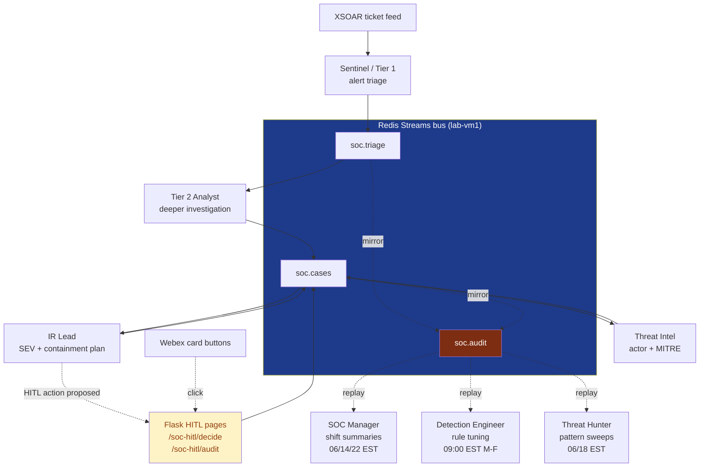
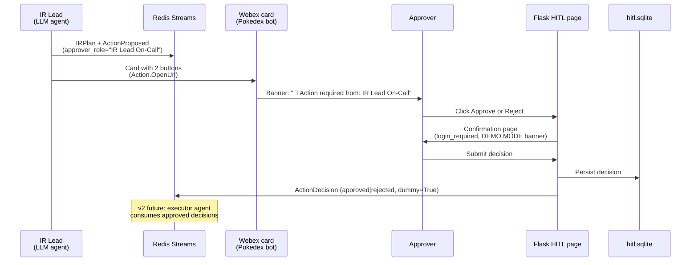

## TL;DR

A real SOC runs 24×7 with eight or nine distinct roles — alert triage, deeper investigation, incident response, threat intel, detection tuning, hunting, shift management, and a human approver for any destructive action. We built an AI version of that whole org chart, coordinated over a Redis Streams bus, with **one** local LLM (GLM-4.7-Flash on a Mac M1) wearing every hat. v1 is read-only against real systems; the only writes are XSOAR notes and Webex cards, plus a human-approval gate on every proposed containment action.

<div class="tldr-cards">
<div class="tldr-card"><span class="tldr-num">8 roles</span><span class="tldr-sub">Sentinel · Tier 2 · IR Lead · Threat Intel · SOC Manager · Detection Eng · Threat Hunter · HITL</span></div>
<div class="tldr-card"><span class="tldr-num">1 LLM</span><span class="tldr-sub">m1 GLM-4.7-Flash via vllm-mlx, with FailoverChatModel to a studio1 backup</span></div>
<div class="tldr-card"><span class="tldr-num">0 writes</span><span class="tldr-sub">to CrowdStrike, Tanium, Zscaler — agents <em>propose</em>, humans <em>execute</em></span></div>
</div>

The interesting parts aren't the agents themselves — there's nothing novel about an LLM-with-tools loop. The interesting parts are: (1) the architectural choices that let one local LLM serve a whole SOC org chart without melting, (2) the human-in-the-loop gate that makes "AI does containment" a real thing a security team will actually trust, and (3) a backtest harness that lets us put hard numbers on agent quality against real historical tickets before we hand the demo to leadership.

## The shape of the problem

A SOC is not a chatbot. It's a 24×7 event-driven pipeline:

- **Alerts land continuously**, not on demand. The system has to be running and consuming events even when nobody is asking it a question.
- **Roles are independent**. Tier 2 doesn't ask Tier 1 a question — it picks up the verdict Tier 1 already published and goes deeper. Threat Intel runs *after* IR Lead, not as part of IR Lead's reasoning.
- **Some roles are reactive, some are periodic**. Sentinel reacts to each new ticket; SOC Manager produces a shift summary every 8 hours; Threat Hunter sweeps the audit log twice a day; Detection Engineer reviews noisy rules on weekday mornings.
- **Destructive actions need a human gate**. An AI that auto-isolates hosts at 3 AM will get unplugged in a month. The interesting question is: what does the handoff look like?
- **Auditability is non-negotiable**. Every decision needs to be replayable for incident retros and tuning.

The architecture is a consequence of those constraints, not the other way around.

## Architecture at a glance



Three reactive roles (Tier 2 / IR Lead / Threat Intel) are long-running consumers on the bus. Three periodic roles (SOC Manager / Detection Engineer / Threat Hunter) are systemd timer units that wake up on a calendar schedule, replay the audit stream, and emit a report. The HITL surface is a Flask blueprint sitting next to the existing IR web app.

## What we considered

The framework choice was load-bearing — once you pick wrong, every later abstraction fights you. We evaluated five paths:

### 1. CrewAI

[CrewAI](https://github.com/crewAIInc/crewAI) is excellent at what it's designed for: a "crew" of role-shaped agents collaborating on one task. Declarative `Agent` + `Task` + `Process` (sequential or hierarchical), with strong primitives for delegation between agents inside the same crew.

The mismatch for a SOC: CrewAI assumes a single in-process orchestration run. *"Spin up a crew, run a task, get an output."* Our roles aren't a crew — they're independent processes with their own uptime, audit, restart semantics, and HITL gates. CrewAI's human-in-the-loop is `human_input=True` on a Task — a blocking stdin prompt during the crew run. That doesn't survive a "Webex card → Flask page → SQLite sidecar → bus event back into the cascade" flow. We'd lose audit-stream replay, backtest, and per-role systemd uptime if we forced this shape.

Where CrewAI *could* slot in: as the internal reasoning of a single role. e.g. inside Tier 2's `handle()`, swap one LLM-with-tool-loop for a small crew (investigator + critic + decider) before emitting the `Tier2Analysis` event. Same bus architecture, more sophisticated per-role thinking. Probably not worth it yet — Tier 2 with a critic-loop pattern works.

### 2. AutoGen

[AutoGen](https://github.com/microsoft/autogen) is conversation-shaped: agent-to-agent chat with an explicit `GroupChat` manager. Great for "two LLMs argue and converge on an answer" — code-writer vs code-reviewer, advocate vs critic.

The mismatch: a SOC isn't a conversation. Tier 2 doesn't *talk to* Tier 1; it consumes Tier 1's verdict. The chat-history-as-state model imposes a context-window tax on a problem that doesn't need it, and the `GroupChat` orchestrator becomes a load-bearing thing you can't restart independently.

### 3. Plain LangChain (no graph, no bus)

The path of least resistance: write a Python function for each role, chain them together, run synchronously. We started here actually, then noticed the smell. The synchronous chain forces every role to wait for the previous one, eliminates per-role restart, makes HITL impossible without a hack, and gives you no audit log unless you build one separately.

If you only have two roles, just do this. We had eight.

### 4. n8n / Zapier / visual workflow tools

[n8n](https://n8n.io/) and similar visual workflow tools were on the list for one specific reason: leadership likes seeing the boxes-and-arrows. But the LLM nodes aren't first-class — you'd be wrapping every model call in HTTP, and the graph is in a database, not in code that's reviewable in a PR. Auditability and reproducibility are both worse than the LangGraph + bus path. (n8n is a great fit for non-LLM SOAR-style automations, just not for this.)

### 5. Build-from-scratch asyncio + Redis Streams

The honest baseline. Python `asyncio` workers, Redis Streams consumer groups, no agent framework. Saves you the framework abstraction, costs you the prompt + tool-loop + state-management plumbing that LangGraph and friends do for free. For a one-role POC, fine. For eight roles, you reinvent LangChain badly.

### What we picked: LangGraph for per-role reasoning + Redis Streams for inter-role coordination

LangGraph gives us a clean per-role tool-loop with explicit state, and Redis Streams gives us the inter-role coordination — durable events, consumer groups for at-least-once delivery, an audit stream that's just another consumer, and the easy retrofit of new roles without touching existing ones.

The split is the point: **LangGraph is the agent runtime, the bus is the org chart.** Don't conflate them.

## One LLM, many hats

We run **one** local LLM — GLM-4.7-Flash 8-bit on a Mac M1 (64 GB) via [vllm-mlx](https://github.com/waybarrios/vllm-mlx) — and every role calls it with a different system prompt and a different tool whitelist. The resilience comes from a `FailoverChatModel` (first described in an [earlier post](/posts/billing-header-kv-cache/)) that transparently falls back to a Qwen3 backup on a studio1 box if the m1 dies, and flips back the moment the primary recovers.

> **📦 New — we open-sourced it.** That `FailoverChatModel` is now a standalone, dependency-light package on PyPI: [`langchain-failover`](https://pypi.org/project/langchain-failover/). `pip install langchain-failover`, point it at two chat models, and you get the same primary/secondary failover that keeps this SOC's brain online when a GPU box drops off — connection-aware (it walks the exception's cause chain), recovery-aware (logs the flip back), and mid-stream-safe. The non-obvious part it gets right: **tool-calling survives the failover** — it binds your tools on *both* legs, so an agent mid-investigation doesn't lose its tools the instant it fails over. That's exactly what a SOC role needs at 3 AM. Source, tests, and docs: [github.com/vinayvobbili/langchain-failover](https://github.com/vinayvobbili/langchain-failover). 🚀
{: .prompt-tip }

Why not multiple model providers per role?

- **Cost** — one model loaded once. The Mac M1 holds 35B params at 8-bit comfortably and tool-calls reliably with the `glm47` parser.
- **Latency** — no inter-provider hop, no API rate limits to coordinate.
- **Operational simplicity** — one health check, one auth header, one log file.
- **The roles aren't actually different intelligences** — they're the same intelligence with different prompts, tool budgets, and JSON output schemas. Tier 2 has 30 tool calls; IR Lead has 15; Threat Intel has 12.

The thing GPT-4 or Claude would buy us isn't *better* reasoning on any one role — it's worse cost economics for a 24×7 deployment. We may revisit for SEV-1 hardest cases, but the default is local.

## The roles

| Role | Driver | Trigger | Bus output | Real-system side effect |
|---|---|---|---|---|
| **Sentinel (Tier 1)** | XSOAR poller | New tickets | `AlertTriaged` | XSOAR triage note |
| **Tier 2 Analyst** | Long-running consumer | `alert.triaged` where TP-malicious or pri ≥ 7 | `Tier2Analysis`, `CaseEscalated` | Webex card on escalation |
| **IR Lead** | Long-running consumer | `case.escalated → ir_lead` | `IRPlan`, `ActionProposed` | Webex card with HITL buttons, XSOAR plan note |
| **Threat Intel** | Long-running consumer | `ir.plan` | `ThreatIntelReport` | Webex card, XSOAR attribution note |
| **SOC Manager** | Timer 06/14/22 EST | calendar | `ShiftSummary` | Webex card |
| **Detection Engineer** | Timer 09:00 EST M-F | calendar | `DetectionTuningReport` | Webex card |
| **Threat Hunter** | Timer 06/18 EST | calendar | `HuntingReport` | Webex card |
| **HITL Flask** | Browser button click | Approval link in Webex card | `ActionDecision` | Decision logged to sidecar SQLite |

Every role's verdict is also persisted to a `verdicts.sqlite` sidecar with `wall_time_ms`, `tool_calls_made`, and (in backtest mode) `ground_truth`, so we can compute agreement rates and latency distributions without instrumenting OpenTelemetry on day one.

## The HITL gate

The hardest design question wasn't "should the AI containment action?" — it's "how does the AI hand off to a human in a way the human will actually engage with?"

We tried a few patterns. The one that works:



Three details matter:

1. **The approver is addressed.** The card banner says "Action required from: IR Lead On-Call" — not "click here to approve." The team knows whose mailbox each card is in.
2. **The Flask confirmation page sits between the click and the recorded decision.** Single-click approve from a Webex card was tempting but wrong — accidental clicks would auto-execute. The two-step (click button → see page → click submit) is the friction we want.
3. **v1 doesn't actually execute.** The decision is logged, an `ActionDecision` event is published, and the demo wraps up there. v2 — an executor agent that consumes `action.decision[approved]` and calls CrowdStrike RTR / Zscaler / Tanium — is straightforward to add once leadership trusts the loop. Trust is earned in v1, not asserted by skipping the gate.

## Putting numbers on it: the backtest harness

The hardest sell to a SOC director isn't "we built it." It's "how do we know it works before we put it on real alerts?"

We have an XSOAR timeline database with 32K+ historical CrowdStrike tickets, each with an `escalation_state` field that tells us whether a human Tier 1 closed it or a human Tier 2/Tier 3 picked it up. That's our ground truth — analyst-curated, no extra labelling required.

The backtest harness samples N closed tickets stratified 50/50 between human-escalated and human-closed, then replays each through the agent cascade with all side effects neutered: bus publishes captured in-memory, Webex sends no-op'd, XSOAR writes no-op'd, HITL store stubbed.

For each ticket we record:

- Sentinel's verdict + priority
- Whether Tier 2 engaged, and what it decided (escalate / close / needs human review)
- Whether IR Lead engaged, and what SEV it assigned
- Whether Threat Intel engaged, and what actor it attributed
- Wall time and tool-call count for each stage

Then we compute the confusion matrix of *cascade-escalated-to-IR-Lead* vs *human-escalated-in-real-life*:

```
TP  human escalated  AND  Tier 2 escalated → IR Lead
FN  human escalated  BUT  Tier 2 closed
FP  human closed     BUT  Tier 2 escalated → IR Lead
TN  human closed     AND  Tier 2 closed
```

Precision and recall on TP/FP/FN give us the numbers leadership wants — *"how often does the AI escalate when humans actually would, and how often does it cry wolf?"* The summary lands in a JSON file that the dashboard panel reads, so the question gets a number, not a vibe.

The harness also has a `--dry-run` mode that swaps the LLM for a canned-JSON stub, so we can validate the plumbing end-to-end in under 2 seconds without burning a single token — and that same harness drives the real-LLM run against a full stratified sample when we want actual agreement numbers rather than a smoke test.

## What surprised us

Three things, in order of how much they changed the design:

1. **The bus is more important than the agents.** We spent the first week tuning prompts. The unlock was when we got the Redis Streams + audit-replay pattern right — at that point, adding a new role became a 200-line file plus a systemd unit, and the existing roles didn't have to know. That's worth more than another 5% on any single agent's quality.
2. **Timer-driven roles are underrated.** SOC Manager / Detection Engineer / Threat Hunter run on a calendar schedule, not on events. They get the same audit stream, so they see everything the reactive agents did, plus everything the audit stream caught that no reactive agent engaged on. Detection Engineer in particular finds tuning candidates a reactive role would never see — *"this rule fired 47 times this week and 41 were closed as benign by Tier 1."*
3. **The right level of role granularity isn't obvious.** We went back and forth on whether Tier 2 + IR Lead should be one role or two. They're two. Tier 2's job is "is this real and how bad?"; IR Lead's job is "given it's real, what's the plan?" Conflating them puts SEV classification in the same prompt as evidence-gathering and the model loses focus. Same with Threat Intel — keeping attribution out of IR Lead's prompt makes both roles tighter.

## Try it / What's next

The full module lives at [`src/components/soc_in_box/`](https://github.com/vinayvobbili/security-ops-platform) — agents, schemas, bus wrapper, verdict store, HITL store, web routes, systemd units, README.

> **📦 New — we open-sourced the kernel.** The reusable heart of this — the event contract, the bus, case memory, and the role-agent framework — is now a standalone, vendor-neutral package on PyPI: [`aisoc`](https://pypi.org/project/aisoc/). `pip install "aisoc[agent]"`, bring your own LLM, alert source, and tools, and you get the same event-sourced multi-agent SOC this post describes: a stdlib-only in-memory bus (or Redis Streams for the durable path), a role team that works a case over the shared log, memory as a read model, human-in-the-loop gating, and a replayable audit you can backtest against. The non-obvious part it gets right: three **injection seams** — chat model, alert source, tools — mean nothing in the kernel knows about any one vendor. The SOC-in-a-Box you just read about is literally *this package* with my environment plugged into those seams. Source, tests, and runnable examples ship in the package. 🚀

What's not in v1 and what we'll work on next:

- **HITL v2 executor.** Real write path — consume `action.decision[approved]` events, call CrowdStrike RTR / Tanium / Zscaler via MCP, log the result back on the bus. The hard parts (audit, approval, identity) are done; only the executor itself is missing.
- **Red Team agent.** Once we have AttackIQ wired into the lab, a Red Team role can post `attack.executed` events that the rest of the cascade has to detect. Closes the loop on "did the SOC actually catch what the Red Team threw?"
- **Backtest as a CI gate.** Once we're confident on a baseline, promote the harness to a nightly run with regression thresholds — "if Tier 2 escalation precision drops more than 5% from last week's baseline, fail the build."

The code is BSD-licensed in the public mirror. If you're building something similar, the most useful thing to copy isn't any one agent — it's the **bus shape**, the **schema-per-event** discipline, the **audit-stream-as-truth** pattern, and the **HITL handoff that addresses a human by role**. Those four ideas are what turned eight separate LLM-with-tools experiments into one thing a SOC team would actually run.
