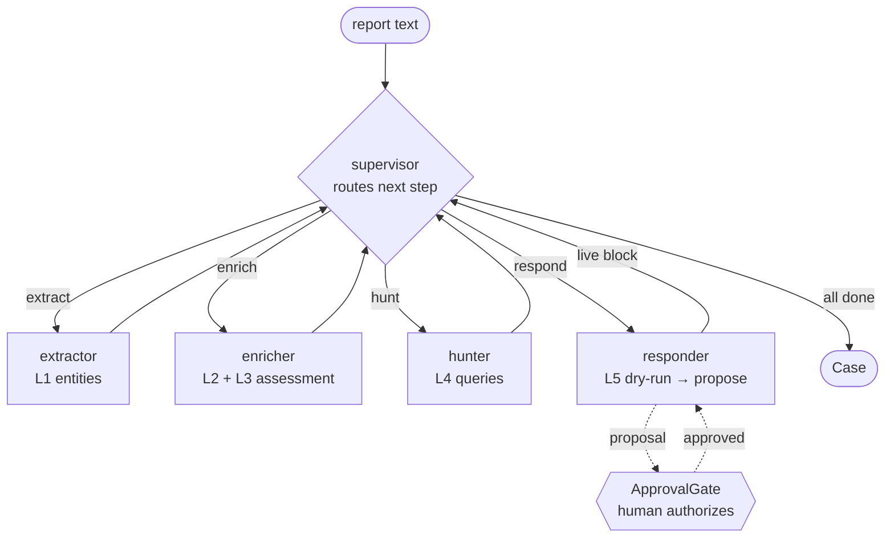

## TL;DR 🚀

I shipped [**iocflow**](https://pypi.org/project/iocflow/) to PyPI — an open-source Python library for the **entire indicator-of-compromise lifecycle**, built as six independently-useful layers behind pip extras. The headline isn't "another IOC parser." It's the *shape*: every layer is a deterministic, boring, testable primitive — and the top layer is a small **LangGraph multi-agent team** that orchestrates those primitives, with a **human-in-the-loop gate** standing between the AI and anything destructive.

<table>
<tr>
<td align="center" width="33%"><h2>6 layers</h2><sub>extract · enrich · comment · hunt · block · agent — each its own pip extra</sub></td>
<td align="center" width="33%"><h2>1 import</h2><sub><code>investigate(text)</code> runs the whole chain as a multi-agent team</sub></td>
<td align="center" width="33%"><h2>0 rogue blocks</h2><sub>LLM <em>proposes</em> · human <em>authorizes</em> · a guard <em>vetoes</em></sub></td>
</tr>
</table>

This is the OSS sibling of [SOC-in-a-Box](/posts/building-soc-in-a-box/), the AI SOC I wrote about last week. SOC-in-a-Box proved the *pattern* against real systems; iocflow packages the *lesson* so anyone can pip-install it. 🧰


_One call: extract IOCs from a report → enrich → suggest hunts → propose blocks → wait for a human → block at the firewall. The benign `8.8.8.8` never even gets proposed._

## The lesson I was carrying over

SOC-in-a-Box was eight analyst roles played by **one** local LLM over a message bus, read-only against production, with a human approving every containment action. The thing that actually made it trustworthy wasn't the agents — an LLM-with-tools loop is not novel. It was two architectural commitments:

1. **The model orchestrates; it doesn't *do*.** The irreversible work — query a SIEM, write a denylist, isolate a host — is done by plain, deterministic code the model merely *calls*. The LLM picks *what* and *when*; the tool decides *how*, the same way every time.
2. **No single authority for a destructive action.** The AI can propose containment all day long. A human clicks the button, and a dumb safety check sits underneath both of them refusing to touch anything on an allowlist.

Those two ideas aren't SOC-specific. They're how you make *any* AI system that touches production safe enough to actually deploy. So I pulled them out of the SOC and built a clean, public library around them. 🧱

## Deterministic primitives first, agents last

iocflow grows in layers, each behind its own extra so `import iocflow` stays a one-dependency install and pulls in nothing you didn't ask for:

- **L1 — extract** (`iocflow`): pull IPs, domains, URLs, hashes, CVEs, MITRE technique IDs, threat actors, and malware families out of unstructured text, with the false-positive defenses you'd otherwise hand-write (Public Suffix List validation, benign allowlists, re-fanging of `evil-domain[.]ru`).
- **L2 — enrich** (`iocflow[enrich]`): look each indicator up against VirusTotal / AbuseIPDB / abuse.ch and return a worst-wins verdict.
- **L3 — comment** (`iocflow[ai]`): an LLM turns the enrichment report into a structured assessment — and falls back to a deterministic, report-derived summary when no model is configured. It *never* raises.
- **L4 — hunt** (`iocflow[hunt]`): render ready-to-run hunt queries — **CrowdStrike CQL**, **Cortex XQL**, and **Sigma** — straight from the indicators, offline and stdlib-only. An LLM can *add* behavioral hunts, but the deterministic queries are always there.
- **L5 — block** (`iocflow[block]`): push malicious indicators to the control points you operate — Palo Alto (EDL feed + live User-ID API), Zscaler, CrowdStrike, Abnormal — with `dry_run=True` as the default *everywhere* and an authoritative allowlist guard.
- **L6 — agent** (`iocflow[agent]`): the capstone. 🤖

Notice that L1–L5 have no idea an agent exists. They're just functions with stable input/output types: `ExtractedEntities → enrich() → EnrichmentReport → comment() → Commentary → suggest() → HuntPlan → block() → BlockReport`. You can use any one of them on its own. That's deliberate — **the agent is a consumer of the primitives, not a replacement for them.**

## The capstone: a small multi-agent team

Layer 6 hands a report to a supervisor that routes to specialist agents — extractor, enricher, hunter, responder — each using L1–L5 as tools, then loops back until the case is done.



```python
from iocflow.agent import investigate

case = investigate(report_text)        # safe: nothing is blocked by default
print(case.commentary.severity.value, "—", case.commentary.summary)
for line in case.trace:                # the agents' reasoning, replayable
    print(" •", line)
```

The model is **any** LangChain chat model. The bundled `default_agent_model()` builds a [`FailoverChatModel`](https://pypi.org/project/langchain-failover/) — primary with an automatic secondary — which is the *same* failover model I extracted from the SOC and published earlier. iocflow eating its own dog food. 🐕 And here's the part that makes it robust: **with no model configured at all, the graph runs the layers in a fixed deterministic order and still produces a complete `Case`.** The LLM is an enhancement, not a dependency.

## Three-layer authority (the part that matters) 🔒

Blocking is the only step that can hurt you, so it gets the full treatment from SOC-in-a-Box:

1. **The agent proposes.** The responder does a *dry run* of L5 — full audit, zero changes — and turns it into a proposal.
2. **A human authorizes.** An `ApprovalGate` reviews the proposal and returns the approved subset. The default is `DenyAllGate` — **an unattended run blocks nothing.**
3. **A guard vetoes.** Underneath both of them, the Layer 5 allowlist guard refuses to touch public resolvers, private ranges, and well-known domains — *even if the report mislabeled them malicious.* You cannot block `8.8.8.8` through this library. The LLM is never the sole authority for a destructive action.

For the gate, I wired a real one to **Slack** — no inbound webhook server, just post-and-poll:

```python
from iocflow.agent import investigate
from iocflow.agent.chat_gate import SlackApprovalGate

gate = SlackApprovalGate(approvers=["U_ANALYST"], timeout=600)
case = investigate(report_text, gate=gate)
# Bot posts the proposed blocks to your channel.
# ✅ from an allowlisted analyst authorizes the plan; ❌ or no reply = denied.
```

It posts the proposed blocks to a channel and polls for a reaction from an **allowlisted** approver — ✅ approves the plan, ❌ or silence denies it, and a timeout defaults to *deny*. The whole thing is a `ChatApprovalGate` over a two-method `ChatTransport` (`post`, `reactions`), so the same flow drops onto Webex, Teams, or a web UI by writing two functions. The transport is a thin seam, which means the gate logic is unit-tested without a single network call.

## Why build it this way

The temptation, when you want to "show AI in your work," is to make *everything* an LLM call. That reads as junior. The stronger story — the one a security team will actually run — is **deterministic primitives plus agentic orchestration**: the boring parts are boring and tested, the AI adds judgment where judgment helps, and a human holds the keys to anything irreversible. 🎯

Everything but the agent layer runs on Python 3.9+; `import iocflow` stays dependency-light; every layer is independently useful; and the whole agent runs offline in tests because the enrichers, blockers, and model are all injectable.

- 📦 PyPI: [`pip install iocflow`](https://pypi.org/project/iocflow/)
- 🛠️ Source: [github.com/vinayvobbili/iocflow](https://github.com/vinayvobbili/iocflow)
- 🧠 The SOC it grew out of: [SOC-in-a-Box](/posts/building-soc-in-a-box/)

If you try it, I'd love to hear what control points you'd plug in. 👋
