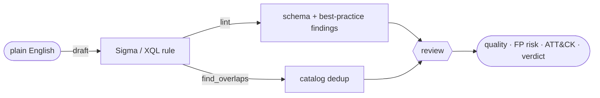

> **Update (v0.2):** detflow now goes the *other* direction too — paste a threat report and get back ATT&CK mappings, generated Sigma/YARA/Suricata, and STIX/Navigator/brief exports. See [detflow Goes Both Ways: From a Threat Report to a Detection Package](/posts/detflow-threat-report-to-detection-package/).
{: .prompt-tip }

## TL;DR 🚀

I shipped [**detflow**](https://pypi.org/project/detflow/) to PyPI — an open-source, **vendor-neutral detection-engineering copilot**. It does the four things I found myself re-implementing inside every detection-as-code workflow: **draft** a detection from plain English (as **Sigma** or **Cortex XSIAM XQL**), **lint** it offline, **find overlaps** against the rules you already run, and **review** it like a senior detection engineer. 🛡️

<table>
<tr>
<td align="center" width="33%"><h2>2 formats</h2><sub>draft &amp; review in <strong>Sigma</strong> or <strong>Cortex XQL</strong> — one portable, one native</sub></td>
<td align="center" width="33%"><h2>1 protocol</h2><sub>bring any model: an OpenAI-compatible endpoint or a LangChain failover chain</sub></td>
<td align="center" width="33%"><h2>0 crashes</h2><sub>lint &amp; overlap need no model; review degrades to a deterministic floor</sub></td>
</tr>
</table>

This is the detection-side sibling of [iocflow](/posts/iocflow-agentic-ioc-lifecycle/). iocflow handles the *indicator* lifecycle; detflow handles the *rule* lifecycle. Same design DNA: **deterministic primitives first, the LLM as an enhancement that can fail without taking the tool down with it.** 🧱

## The itch

A detection-as-code pipeline — the kind that turns a rule into a reviewed, tested merge request — has a handful of stages that have nothing to do with your SIEM vendor:

- Is this rule even *valid*? (lint / schema-check)
- An analyst can describe the behavior but doesn't write Sigma fluently — can we *draft* the first version?
- Are we about to ship coverage we **already have**? (dedup against the catalog)
- Would a senior engineer *approve* this, and what would they flag? (quality, false-positive risk, ATT&CK mapping, gaps)

I'd written those four stages more than once. They're generic — the only vendor-specific parts of a real pipeline are *compiling* to your query language and *dry-running* against your tenant. So I carved the generic four out of a detection-as-code workbench I'd built and made them a clean, public library. 🧰

## What it looks like

Draft a detection from a sentence — in either language:

```python
import detflow

sigma = detflow.draft("powershell with an encoded command spawned from a Word macro")
print(sigma.rule)                       # a full Sigma rule, ready to lint

xql = detflow.draft("same thing, but for Cortex XSIAM", fmt="cortex-xql")
print(xql.rule)                         # dataset = ... | filter ... | limit 100
```

Lint it offline — no model, no network, no keys:

```python
report = detflow.lint(sigma.rule)       # or lint_sigma / lint_xql
print(report.status, report.summary)    # "pass" / "warn" / "fail"
for f in report.findings:
    print(f.level, f.message)
```

Review it like a senior engineer, deduped against your own inventory:

```python
catalog = [
    {"name": "Encoded PowerShell", "source": "crowdstrike", "techniques": ["T1059.001"]},
    {"name": "WMI Process Create",  "source": "sigma",       "techniques": ["T1047"]},
]
result = detflow.review(sigma.rule, catalog=catalog)
print(result.quality_score, result.false_positive_risk, result.verdict)
for o in result.overlaps:               # "you may already cover this"
    print(" •", o.source, o.name, "—", o.reason)
```

The whole flow, end to end:





There's a CLI too, for the terminal-and-CI crowd:

```bash
detflow draft "credential dumping via comsvcs MiniDump" -f cortex-xql
detflow lint rule.yml
detflow review rule.yml --catalog catalog.json --json
```

## Model-agnostic on purpose 🔌

detflow doesn't import an SDK or hard-code a provider. A "model" is anything with one method:

```python
def complete(self, system: str, user: str, *, json: bool = False) -> str: ...
```

That gives you three ways in. A built-in `OpenAIChatModel` talks to any OpenAI-compatible endpoint — OpenAI, Azure, a local vLLM/Ollama server, a gateway. `default_model()` builds one from `DETFLOW_LLM_*` env vars. Or you wrap **any** LangChain chat model:

```python
from langchain_failover import FailoverChatModel
from detflow.llm import LangChainModel

chain = FailoverChatModel(models=[primary, local_fallback])
model = LangChainModel(chain)
detflow.review(rule, catalog=catalog, model=model)   # rides the failover chain
```

That `FailoverChatModel` is [langchain-failover](https://pypi.org/project/langchain-failover/), another package I extracted and published — so a primary-model outage transparently falls back to a secondary mid-review. Three of my OSS packages quietly eating each other's dog food. 🐕

## Never-raises, deterministic floor

The contract I care about most: **detflow degrades, it doesn't break.** 🎯

- **Lint and overlap need no model at all** — they're pure, stdlib-plus-PyYAML, and run in CI with zero secrets.
- **Drafting** requires a model (you're asking it to write), but a model error comes back as a result with an `error` field, not an exception.
- **Review** uses a model when one is present and falls back to a **deterministic floor** when it isn't — you still get the lint results, the catalog overlaps, and the parsed ATT&CK techniques. `review()` never raises.

So detflow is safe to drop into a pipeline that sometimes has an LLM available and sometimes doesn't. The boring, testable parts stay up regardless; the AI adds judgment when it can.

## Why two formats

Sigma is the portable, reviewable, vendor-neutral standard — it lints cleanly and ports across SIEMs. Cortex XSIAM **XQL** is what actually runs on that platform. Supporting both means you can author once in Sigma for portability, or go straight to XQL when you want the platform's full expressiveness — and detflow lints and reviews either one. The drafting prompts are language-aware (the XQL prompt knows XQL has no `startswith`/`endswith` and uses `| filter`, not SQL `where`), so you don't get SQL-shaped hallucinations back. 🧠

## The bigger pattern

This is the same lesson as the IOC work: when you want to *show* AI in your engineering, the junior move is to make everything an LLM call. The stronger, more deployable story is **deterministic primitives plus optional AI** — the schema checks and dedup are boring and tested, the model writes and reviews where judgment helps, and nothing falls over when the model is slow or absent.

detflow runs on Python 3.9+, keeps `import detflow` dependency-light (the LLM client is an extra), ships `py.typed` for downstream type-checking, and every piece is independently useful.

- 📦 PyPI: [`pip install detflow`](https://pypi.org/project/detflow/)
- 🛠️ Source: [github.com/vinayvobbili/detflow](https://github.com/vinayvobbili/detflow)
- 🧩 Its indicator-side sibling: [iocflow](/posts/iocflow-agentic-ioc-lifecycle/)

If you run a detection-as-code pipeline, I'd love to know which query language you'd want next. 👋
