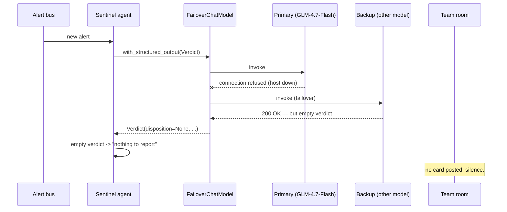

## TL;DR

I run [SOC-in-a-Box](/posts/building-soc-in-a-box/) — a multi-agent AI SOC where
one local LLM plays every analyst role behind a human-in-the-loop gate. One
afternoon it stopped posting verdicts to the team room. No exception. No alert.
No error in any log. It just went quiet, and stayed quiet, for long enough that
*the quiet* was the only symptom.

The root cause wasn't a crash. It was the opposite: my failover worked
**perfectly**. The primary model host died, the [FailoverChatModel](https://pypi.org/project/langchain-failover/)
transparently switched to the backup, every request came back `200 OK` — and the
backup returned **empty structured output**. An empty verdict reads, to the rest
of the pipeline, exactly like "nothing to report." So the SOC reported nothing.

<table>
<tr>
<td align="center" width="33%"><h2>200 OK</h2><sub>every backup request succeeded — with an empty verdict inside</sub></td>
<td align="center" width="33%"><h2>0 errors</h2><sub>nothing raised, nothing logged; the room just went silent</sub></td>
<td align="center" width="33%"><h2>1 check</h2><sub>validate the output, not the transport — and fail loud on empty</sub></td>
</tr>
</table>

The fix was one guard clause. The lesson took longer: in an LLM pipeline,
**"the call succeeded" and "the call produced a usable answer" are different
questions**, and if you only monitor the first one, the second one can fail in
total silence.

## The symptom: a room that just stopped

SOC-in-a-Box posts a card to a team chat room for every alert it triages —
disposition, reasoning, recommended action, and a button for a human to approve
anything destructive. Those cards are the heartbeat of the system. You glance at
the room and you know it's alive.

The first sign something was wrong wasn't an alert. It was the *absence* of one.
A colleague asked, almost in passing, whether the bot was "having a slow day."
It hadn't posted in a while. I checked: no cards for the better part of an hour.

Here's the part that makes silent failures so nasty: **every dashboard was
green.** The service was up. The scheduler was running. CPU was fine. The chat
integration's last call was a `200`. Nothing was on fire, because nothing had
thrown. The system was, by every metric I had, *healthy* — and producing
absolutely nothing.

## The wrong guesses

When a thing that posts to chat stops posting to chat, your brain goes to the
chat layer first. I burned a good twenty minutes there:

- **Chat API token expired?** No — last send returned `200`, and a manual test
  message went through fine.
- **Rate limited / dropped webhook?** No retries piling up, no `429`s, queue
  empty.
- **Scheduler wedged?** Nope — it was happily picking up alerts and running them
  end to end. Logs showed each alert being *processed*. They just weren't
  producing a card at the end.

That last point was the tell. The pipeline wasn't stuck. It was running to
completion and deciding, every single time, that there was nothing worth
posting. Which meant the bug wasn't in the *plumbing*. It was in the *verdict*.

The one command that actually cracked it was embarrassingly low-tech. Instead of
chasing the chat layer, I checked whether my primary inference host was even
alive:

```bash
ss -tlnp | grep 8015   # the primary model's port
# (nothing)
```

Nothing was listening. The primary box — an M1 Mac serving GLM-4.7-Flash via
[vllm-mlx](https://github.com/waybarrios/vllm-mlx) — had fallen over. And yet
the SOC hadn't errored out, because it was *designed* not to.

## What was actually happening

SOC-in-a-Box doesn't call a single model. It calls a `FailoverChatModel`: a
thin wrapper around a primary and a backup chat model that serves from the
primary, transparently falls back to the secondary on connection errors, and
flips back when the primary recovers. (I later
[extracted that wrapper into an OSS package](https://pypi.org/project/langchain-failover/) —
it came directly out of this system.)

The failover did its job *flawlessly*. The primary refused connections, so every
agent's LLM call quietly routed to the backup — a second Mac running a different
model. From the application's point of view, nothing changed: it asked for a
structured verdict, it got a `200`, it moved on.

The problem is what "a structured verdict" means. The Sentinel agent doesn't
want free text; it wants a typed object:

```python
class Verdict(BaseModel):
    disposition: Literal["benign", "suspicious", "malicious"]
    confidence: float
    reasoning: str
    recommended_action: str

verdict = sentinel_llm.with_structured_output(Verdict).invoke(prompt)
```

The primary model is reliable at this — it's the one I tuned for tool-calling and
constrained output. The **backup model wasn't.** Under `with_structured_output`,
it returned a response that parsed to an effectively *empty* object — no
disposition, no reasoning. Not an error. Not malformed JSON that would raise.
Just… empty. A well-formed nothing.

And the card builder, reasonably, treated an empty verdict as "no finding":

```python
# the original, trusting version
if verdict.disposition:           # empty -> falsy -> skip
    post_card(verdict)
```

So every alert ran, failed over, came back blank, and got silently dropped on
the floor.



Every arrow in that diagram is a success. There is no failure anywhere in the
flow — except the one that matters, and it has no edge of its own.

## The real bug was "it didn't crash"

This is the uncomfortable part. I built the failover *specifically* so that a
dead primary wouldn't take the SOC down. It succeeded at that goal completely.
The SOC stayed up. It just stopped doing the one thing it exists to do.

We're trained to treat exceptions as the bad outcome and clean returns as the
good one. LLM pipelines quietly invert that. A model that's down throws a
connection error — loud, obvious, easy to alert on. A model that's *up but
worse* returns a `200` with a degraded answer, and degraded-but-valid is
invisible to everything that watches for errors.

The failure mode has a shape: **success-shaped.** It comes back through the happy
path, with the right status code and the right type, and it's wrong. You cannot
catch it with a `try/except`, because nothing is thrown. You can only catch it by
*asking whether the output is actually any good* — which most of us don't,
because we already checked the box that said the call worked.

## The fix: validate the output, not the transport

The one-line version: an empty or partial verdict is a **failure**, not a quiet
all-clear. Treat it like one.

```python
verdict = sentinel_llm.with_structured_output(Verdict).invoke(prompt)

# an empty/partial verdict means the model didn't actually do the job.
# do NOT let it read as "nothing to report".
if not verdict or not verdict.disposition or not verdict.reasoning:
    raise EmptyVerdictError(model=active_model_name(), alert_id=alert.id)

post_card(verdict)
```

`EmptyVerdictError` does three things the silence never did: it shows up in logs,
it triggers an actual alert, and — critically — it lets the pipeline *retry or
escalate* instead of swallowing the alert. A blank verdict on a real alert is now
a page, not a no-op.

Two layers of hardening on top of that:

**1. Make the failover aware of bad output, not just dead sockets.** A
connection-error failover can't see an application-level "the answer is empty"
problem — by the time the bytes come back, the transport already succeeded. So
the validation has to live at the call site (above), *or* you give the failover a
response validator so an empty structured result counts as a miss and it can try
the other model:

```python
llm = FailoverChatModel(
    primary=primary,
    secondary=backup,
    # treat an unusable response as a failover trigger, not just exceptions
    is_valid=lambda resp: bool(getattr(resp, "disposition", None)),
)
```

**2. Monitor for silence, not just for errors.** The deepest fix isn't code at
all — it's a canary. I now run a synthetic alert through the full pipeline on a
schedule; if it doesn't produce a card within a few minutes, *that* pages me.
Absence is a signal. If the only way you find out your SOC stopped working is a
human noticing the room is quiet, you don't have monitoring — you have luck.

## The lesson

> In an LLM system, "the call succeeded" and "the call produced a usable answer"
> are two different questions. Monitor only the first and the second can fail
> completely silently.

A few things I carry out of this one:

- **Failover that hides degradation is half a feature.** Falling back to a worse
  model keeps you *up*, but "up" isn't the goal — *correct output* is. If the
  backup can't actually do the job, silently using it is just a slower way to
  fail.
- **Validate the answer, not the HTTP status.** Especially with structured
  output: "it parsed" is not "it's complete." An empty typed object is a lie the
  type system will happily tell you.
- **Alert on absence.** Errors are easy; silence is hard. Build the canary that
  notices when nothing happened.
- **Know your models' real reliability per task.** My primary and backup are not
  interchangeable for constrained output, and pretending they were is what turned
  a dead host into a dead SOC.

The whole thing came back the moment the primary came back online — which is its
own trap, because a bug that self-heals is a bug that comes back. Now it fails
loud, retries on the backup, escalates if both come up empty, and a canary
watches the silence. The failover wrapper that started all this is on PyPI as
[langchain-failover](https://pypi.org/project/langchain-failover/) if you want
the primary/secondary-with-recovery pattern; just remember it can only see the
failures that throw. The ones that come back `200 OK` and empty are yours to
catch.

*If you're building anything that puts an LLM in a pipeline and walks away — a
SOC, an agent, a batch job — go look right now for the place where an empty
response reads as "all clear." I promise it's in there.*
