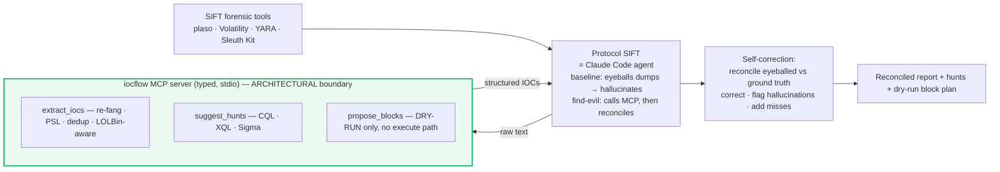

## TL;DR 🔎

I built [**find-evil**](https://github.com/vinayvobbili/find-evil) for the SANS **FIND EVIL!** hackathon. [Protocol SIFT](https://github.com/teamdfir/protocol-sift) is a sharp idea — put a Claude Code agent in front of the SANS SIFT Workstation's 200+ forensic tools so a responder can investigate at machine speed. It works. But the brief says the quiet part out loud: *"it also hallucinates more than we'd like."* find-evil bolts my open-source [`iocflow`](https://github.com/vinayvobbili/iocflow) IOC lifecycle onto it as a **custom MCP server plus one skill**, so the agent stops eyeballing huge dumps and instead **reconciles its own findings against a deterministic, false-positive-defended extractor** — catching its hallucinations before they reach the report.

<table>
<tr>
<td align="center" width="33%"><h2>1 skill</h2><sub>extract → reconcile / self-correct → hunt, instead of asserting by eye</sub></td>
<td align="center" width="33%"><h2>0 shell verbs</h2><sub>the MCP server is text-in / dict-out — the agent <em>cannot</em> spoliate evidence or push a block</sub></td>
<td align="center" width="33%"><h2>1 real C2</h2><sub>found fileless Empire C2 on the SANS image — and refused to invent any on the clean host</sub></td>
</tr>
</table>

This is the DFIR-facing sibling of [iocflow](/posts/iocflow-agentic-ioc-lifecycle/) and [SOC-in-a-Box](/posts/building-soc-in-a-box/): same architectural conviction — *the model orchestrates, deterministic code does the dangerous part* — pointed at a forensic agent on a SANS Workstation. 🛡️


_A live Protocol SIFT investigation: the agent extracts, reconciles against ground truth, corrects its own read, and hunts — on the real SANS compromised image._

## Why a forensic agent hallucinates 🧠

I've spent years building an AI SOC, and I know exactly *why* this happens. The agent runs a forensic tool, gets back a 50,000-line text dump, and then **eyeballs it** to pull out indicators. That's where reality breaks:

- a defanged `evil[.]ru` gets read back as `.com`,
- an IP's last octet gets transposed (`185.220.101.50` for `185.220.101.5`),
- `powershell.exe` gets called "the malware" when it's a LOLBin.

Free-text reading of enormous dumps is precisely the task LLMs are *worst* at. And in DFIR a wrong indicator isn't a typo — it's a wrong containment decision at 3 AM. So I didn't try to make the agent "read more carefully." **I took the reading away from it.**

## The fix: hand the reading to a deterministic parser 🧱

```
SIFT forensic tool (plaso / Volatility / YARA / Sleuth Kit)
        │  raw text dump
        ▼
Protocol SIFT agent (Claude Code)   ── calls instead of eyeballing ──┐
        ▲                                                            ▼
        │  structured, re-fanged, PSL-validated IOCs   iocflow MCP server
        └────────────────────────────────────────────────────────────┘
        │  reconcile eyeballed findings vs extractor ground truth
        ▼
correct values · flag hallucinations · add misses → report + hunts + dry-run blocks
```

Protocol SIFT, it turns out, **isn't an MCP framework — it *is* Claude Code** configured on the SIFT box (`~/.claude/CLAUDE.md`, a permissions `settings.json`, and five `skills/*/SKILL.md`). That's a gift, because Claude Code natively loads MCP servers and skills. So the integration is small and first-class, not a hack — two supported patterns at once: **Direct Agent Extension** *and* **Custom MCP Server**.



The security boundary is **architectural, not prompt-based**. The MCP server exposes no `execute_shell`; `propose_blocks` is dry-run by construction and the block-execution path is deliberately not a tool. The agent can't spoliate evidence or push a block because those verbs *don't exist* — that turns "please be careful" (bypassable) into "you physically cannot."

## The money-shot self-correction ⟲

I ran it for real against the SANS *Example Compromised System Data* — a clean host and a compromised one, memory + disk, read-only, SHA256-hashed before and after (**unchanged**).

On `base-wkstn-05`, the agent found a 2018 APT scenario: a `WmiPrvSE → powershell → rundll32` chain, a **fileless PowerShell Empire** gzip-base64 stager, and lateral movement under a stolen SQL service account. But the best moment was a correction:

> `netscan` showed **only internal peers** — a proxy at `172.16.4.10:8080`. The eyeball read was *"no external C2 — contained."* **Wrong.** The real C2 (`www.venetodns.trade`) egresses *through the proxy*, so it never appears as a foreign IP in the connection table. The extractor surfaced it from the **PowerShell command text** instead, and the agent corrected itself: *there IS external C2; the connection table alone misled me.*

Genuine, not staged. And it cut the other way too — **false-positive discipline**: 15 suspicious external domains were in strings, but only one is tied to the intrusion. The other 14 are Outlook mail-spam. The agent reported **1 confirmed C2, 14 unverified** — not a "15 malicious domains" headline. `cluster_actor_infrastructure` returned **0 campaigns** rather than fabricate attribution, and `propose_blocks` stayed `dry_run: true`.

## Honesty cuts both ways 🧼

On the clean `base-wkstn-01`, four scary-looking artifacts each got *cleared with a tool*, not waved away: `malfind` empty (refutes injection), `subject_srv.exe` = an F-Response IR agent, and `Mnemosyne.sys` = F-Response's **signed acquisition driver**, not a rootkit. Zero confirmed evil, zero retained hallucinations.

That's the property I care about most: it **found evil where it existed and refused to invent it where it didn't.** Every finding traces back to a specific `mcp__iocflow__*` tool call in the execution log — which, in a hackathon judged on "honesty over perfection," is the whole game.

## What I took away 📚

The strongest guardrail isn't a better prompt — it's an **architecture where the dangerous action doesn't exist as a tool**, and the strongest anti-hallucination move is the same shape: don't ask the LLM to read more carefully, **hand the reading to a deterministic parser and make the LLM reconcile.** The agent's job becomes judgment over provenance, not transcription of a 50,000-line dump.

It's MIT-licensed and bolts onto any Protocol SIFT box in one script:

- **Repo:** [github.com/vinayvobbili/find-evil](https://github.com/vinayvobbili/find-evil)
- **Built on:** [`iocflow`](https://github.com/vinayvobbili/iocflow) (the IOC lifecycle) and [`domainflow`](https://github.com/vinayvobbili/domainflow) (the campaign-clustering pivot)
- **Demo:** [the live investigation above](https://youtu.be/8ufHSoOfc5Q)

```bash
# on the SIFT Workstation, after protocol-sift's own installer
curl -fsSL https://raw.githubusercontent.com/vinayvobbili/find-evil/main/install.sh | bash
claude mcp list   # expect: iocflow
```

Next up: expose iocflow's ATT&CK coverage-gap check as an MCP tool so the agent also answers *"can we even detect this?"* inline, and publish a reconciliation benchmark — hallucination-rate with and without find-evil over labeled cases — as a community baseline. 🚀
