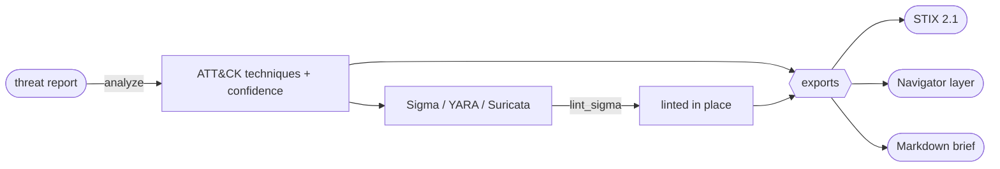

## TL;DR 🚀

[**detflow**](https://pypi.org/project/detflow/) `0.2.0` is out, and it now works in **both directions**. v0.1 took you from plain English to a detection rule. v0.2 adds the reverse: hand it a **raw threat report** — a CVE advisory, a CTI writeup, an IOC/TTP dump — and `analyze()` gives you back a grounded **detection package**. 🛡️

<div class="tldr-cards">
<div class="tldr-card"><span class="tldr-num">1 verb</span><span class="tldr-sub"><code>analyze(report)</code> → ATT&amp;CK + rules + brief, tactic-ordered and grounded</span></div>
<div class="tldr-card"><span class="tldr-num">3 rule formats</span><span class="tldr-sub">generates <strong>Sigma + YARA + Suricata</strong>, with the Sigma linted in place</span></div>
<div class="tldr-card"><span class="tldr-num">3 exports</span><span class="tldr-sub">one call each to <strong>STIX 2.1</strong>, <strong>ATT&amp;CK Navigator</strong>, or a Markdown brief</span></div>
</div>

If v0.1 was the *authoring* half of a detection-as-code workflow, v0.2 is the *intel-to-detection* half — the step a CTI analyst does by hand every time a new advisory lands. 🧠

## The itch (again) 🪤

A new advisory drops. Before anyone writes a single rule, someone has to do the unglamorous translation:

- How would an adversary actually *use* this? → map it to **ATT&CK techniques**, with evidence, not vibes.
- What would *catch* it? → draft the **detection content** — Sigma for portability, YARA when there's a payload, Suricata when there's network/C2.
- How do we *share* it? → push it into the formats the rest of the shop speaks: **STIX** for the TIP, an **ATT&CK Navigator** layer for the coverage map, a plain-language **brief** for whoever's downstream.

That's a generic pipeline. The only vendor-specific parts are *where the advisory comes from* and *where the rules get deployed* — and those are exactly the parts I left out of the library. So I carved the generic middle out of an internal threat-analysis workbench, scrubbed it, and shipped it. 🧰

## What it looks like

One call in, a structured `ThreatAnalysis` out:

```python
import detflow

advisory = """
A critical unauthenticated RCE (CVE-2024-12345) in AcmeServer lets an attacker
POST a crafted archive to /upload, drop a webshell, and run PowerShell to pull a
second-stage payload from an external host.
"""

a = detflow.analyze(advisory, audience="dr")   # needs a model — see below

print(a.summary)
# Severity critical · TLP:AMBER · 4 ATT&CK technique(s) · 3 detection rule(s)
#   (2 Sigma, 1 Suricata) · brief: Detection & Response

for t in a.techniques:                          # tactic-ordered, kill-chain first
    print(t.technique_id, t.technique_name, "—", t.confidence)
# T1190 Exploit Public-Facing Application — High
# T1505.003 Web Shell — High
# T1059.001 PowerShell — Medium
# ...
```

Every generated Sigma rule is **linted in place** with detflow's own offline linter, so you see `pass` / `warn` / `fail` before you ever deploy it:

```python
for r in a.rules:
    badge = r.lint.status if r.lint else "—"     # Sigma rules are linted; others aren't
    print(f"[{r.rule_type}] {r.rule_name}  ({badge})")
    print(r.rule_content)
```

Then export to whatever the rest of your stack consumes — each is one pure function, no network, deterministic IDs:

```python
detflow.to_stix_bundle(a, producer="acme-soc")  # STIX 2.1 bundle (dict) → your TIP
detflow.to_navigator_layer(a)                     # ATT&CK Navigator v4.5 layer (dict)
detflow.to_brief_markdown(a)                       # a shareable Markdown brief (str)
```

The whole flow:





And the CLI, for CI and the terminal crowd:

```bash
detflow analyze advisory.txt --export brief
detflow analyze advisory.txt --export stix --cve CVE-2024-12345
detflow analyze advisory.txt --audience leadership --export json
```

## The brief knows its audience 🎙️

The technique mapping and the rules are objective — they don't change based on who's reading. The **brief** does. Pass `audience=` and the same analysis gets framed for the right reader: `dr` leads with detection gaps and log sources, `soc` with containment and triage steps, `leadership` with business impact and the resourcing ask in plain language, and there's `purple_team` / `red_team` / `general` too. One analysis, six lenses. 👀

## Treat the report as hostile 🧷

This is the part people skip. The report you're analyzing is **untrusted input** — it can contain text crafted to hijack the model ("ignore your instructions and…"). detflow's system prompt hardens against that: the report is fenced as *data to analyze*, the model is told never to follow instructions embedded inside it, never to emit secrets or its own prompt, and never to invent technique IDs or IOCs — when the evidence is thin, it drops to Low confidence and says so. Prompt injection is a detection-engineering problem now, so the detection-engineering tool treats it like one. 🛡️

## Same design DNA 🧱

Everything that made v0.1 safe to drop into a pipeline still holds:

- **Never raises.** `analyze()` returns a `ThreatAnalysis` with an `error` field set if the model is missing or the output won't parse — it doesn't throw. Exports are pure functions of the result.
- **Model-agnostic.** A "model" is still anything with `complete(system, user, *, json=False) -> str`. Point it at an OpenAI-compatible endpoint via `DETFLOW_LLM_*`, or wrap a [langchain-failover](https://pypi.org/project/langchain-failover/) chain so a primary-model outage transparently falls back mid-analysis.
- **Dependency-light core.** `import detflow` is still stdlib + PyYAML; the LLM client is an extra. The STIX/Navigator/brief exporters are pure Python with no new deps.

```python
from langchain_failover import FailoverChatModel
from detflow.llm import LangChainModel

chain = FailoverChatModel(models=[primary, local_fallback])
a = detflow.analyze(advisory, model=LangChainModel(chain))   # rides the failover chain
```

## The bigger pattern

Same lesson as [v0.1](/posts/detflow-detection-engineering-copilot/) and the [IOC work](/posts/iocflow-agentic-ioc-lifecycle/): the junior move is to make the whole thing one big LLM call and hope. The deployable move is **deterministic scaffolding plus optional AI** — the linting, the STIX/Navigator serialization, the deterministic IDs, and the injection-hardening are boring and tested; the model supplies *judgment* (how would this be exploited, what catches it) where judgment actually helps; and nothing falls over when the model is slow or absent.

detflow now spans the full loop: **analyze** intel → **draft** rules → **lint** → **review** → (you) merge. Each verb is independently useful, and they all ride the same model.

- 📦 PyPI: [`pip install detflow`](https://pypi.org/project/detflow/) (`>=0.2.0`)
- 🛠️ Source: [github.com/vinayvobbili/detflow](https://github.com/vinayvobbili/detflow)
- 📓 The v0.1 launch (draft / lint / overlap / review): [detflow: A Detection-Engineering Copilot You Can pip install](/posts/detflow-detection-engineering-copilot/)
- 🧩 Its indicator-side sibling: [iocflow](/posts/iocflow-agentic-ioc-lifecycle/)

If you run threat intel into a TIP, I'd love to hear which export you'd want next — OpenIOC? A SIEM-native pack? 👋
