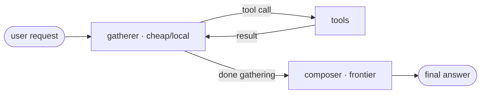

## TL;DR 🚀

[**langchain-failover**](https://pypi.org/project/langchain-failover/) `0.2.0` grows a second trick. v0.1 was a **failover** wrapper — serve from a primary chat model, fall back to a secondary on a connection error, with tool-calling surviving the switch. v0.2 reframes the package as **multi-model orchestration** and adds the other reason you run more than one model: **tier-split**. 🎛️

<table>
<tr>
<td align="center" width="33%"><h2>2 strategies</h2><sub><strong>failover</strong> for resilience, <strong>tier-split</strong> for cost/latency — one interface</sub></td>
<td align="center" width="33%"><h2>2 tiers</h2><sub>gather on a <strong>cheap/local</strong> model, compose on a <strong>frontier</strong> one</sub></td>
<td align="center" width="33%"><h2>0 new deps</h2><sub>still <code>langchain-core</code> only; the tiers compose with failover</sub></td>
</tr>
</table>

The headline result from the production SOC this came out of: on a contended local GPU, the agent's final turn went from **multiple minutes to a couple of seconds** — without changing a single tool. ⚡

## The itch 🪤

Watch where a tool-calling agent actually spends its time. The **loop** — read the request, pick a tool, read the result, pick the next tool — is short, structured reasoning. Then comes the **final answer**: a long, well-formatted, user-facing write-up. That last generation is where the tokens (and the seconds) pile up.

Now run that on a **local** model sharing one GPU with everything else in your shop. The loop is fine — short bursts. But the long final generation lands right when the box is busy, and a 200-token-per-second model composing a detailed answer under contention is *slow*. Meanwhile you very likely have a fast frontier model one HTTP call away that would write that answer in a second or two.

So why is the model that's good at *deciding which tool to call* also the one *writing your prose*? It doesn't have to be. ✂️

## Tier-split 🔪

`TieredChatAgent` runs the gathering loop on a `gatherer` (cheap/local) and composes the answer on a `composer` (frontier):

```python
from langchain_failover import TieredChatAgent

agent = TieredChatAgent(
    gatherer=local_llm,      # cheap/local — drives the tool loop (tools bound for you)
    composer=frontier_llm,   # frontier — writes the final answer from gathered data
    tools=[search, lookup_host, get_timeline],
)

print(agent.invoke("What changed in the incident overnight?").content)
```

Under the hood: the gatherer is told to **gather, then stop** — call the tools the request needs, then signal done; *do not* write the prose answer. The agent executes each tool call (a tool that errors becomes its result text, never an exception, so the loop keeps going), and once gathering is done it hands the collected tool output to the composer to write the answer.



The long generation runs on the fast model, off the busy box. The local model only ever emits short loop turns. That's the whole trick — and it's the difference between a multi-minute and a multi-second final turn. ⏱️

## The part that bites you: answering from zero data 🧷

Here's the failure mode that makes a naïve version dangerous. The gatherer sometimes signals "ready to answer" **before calling any tool**. If you compose at that point, the frontier model writes a confident answer from *nothing* — a fluent "no affected hosts were found" when you never actually looked. In a security context that's not a bug, it's an incident.

So tier-split has a structural safety invariant, `is_premature_marker`:

```python
from langchain_failover import is_premature_marker

# tools were available, none were called, yet the model signaled done → premature
is_premature_marker(content, tools_bound=True, tools_called=False)   # True
is_premature_marker("Hi! How can I help?", tools_bound=True, tools_called=False)  # False
```

It's a **structural** check — *tools were available ↔ none were called* — not a content heuristic. When it trips, the agent nudges the model once ("you haven't gathered anything yet — call the tool now") and continues. A genuine no-lookup answer (a greeting, a definition) has real content and no marker, so it passes straight through and is returned as-is without bothering the composer. The composer never writes an answer from zero tool data. 🛡️

## It composes with failover 🧩

Both tiers are plain LangChain chat models, so either one can itself be a `FailoverChatModel`. Gather on a failover pair *and* compose on a failover pair — resilience and cost/latency at the same time:

```python
from langchain_failover import FailoverChatModel, TieredChatAgent

gatherer = FailoverChatModel(primary=local_a, secondary=local_b)   # resilient gather
composer = FailoverChatModel(primary=frontier, secondary=local_a)  # resilient compose
agent = TieredChatAgent(gatherer=gatherer, composer=composer, tools=tools)
```

And if you already run your own agent loop, you don't need the whole class — `synthesize_answer(composer, query, messages)` is just the compose step. It flattens the `ToolMessage`s into a clean, model-portable prompt (many hosted models reject orphaned tool-call transcripts) and strips `<think>…</think>` blocks that local reasoning models leak into the answer.

## The bigger pattern

Same lesson as [iocflow](/posts/iocflow-agentic-ioc-lifecycle/) and [detflow](/posts/detflow-detection-engineering-copilot/): the junior move is *one big model does everything*. The deployable move is to **put each token on the right model** — cheap reasoning where it's cheap, strong generation where it pays off — with a structural guard so the optimization can't quietly produce a wrong answer.

v0.1 of this package shipped because a local SOC LLM needed a backup mid-incident. v0.2 ships because that same local LLM was too slow to *write* under load — and the fix wasn't a bigger local model, it was not making the local model write at all. Two ways to run more than one model, one tiny interface.

- 📦 PyPI: [`pip install langchain-failover`](https://pypi.org/project/langchain-failover/) (`>=0.2.0`)
- 🛠️ Source: [github.com/vinayvobbili/langchain-failover](https://github.com/vinayvobbili/langchain-failover)
- 🏗️ The AI SOC it came out of: [SOC-in-a-Box: One LLM, Eight Hats](/posts/building-soc-in-a-box/)
- 🧩 Sibling OSS: [iocflow](/posts/iocflow-agentic-ioc-lifecycle/) · [detflow](/posts/detflow-detection-engineering-copilot/)

If you run agents on local models, I'd love to hear what your gather/compose split looks like. 👋
