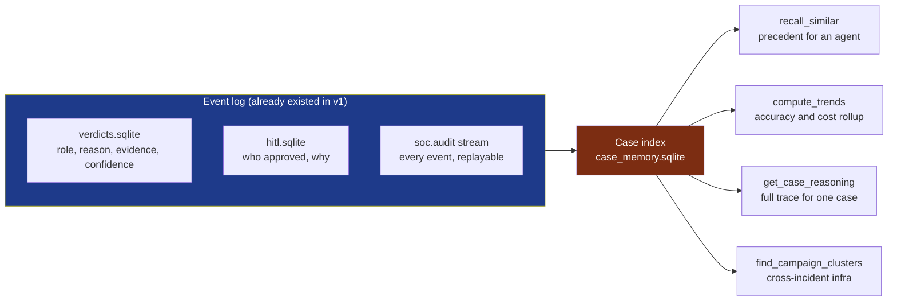
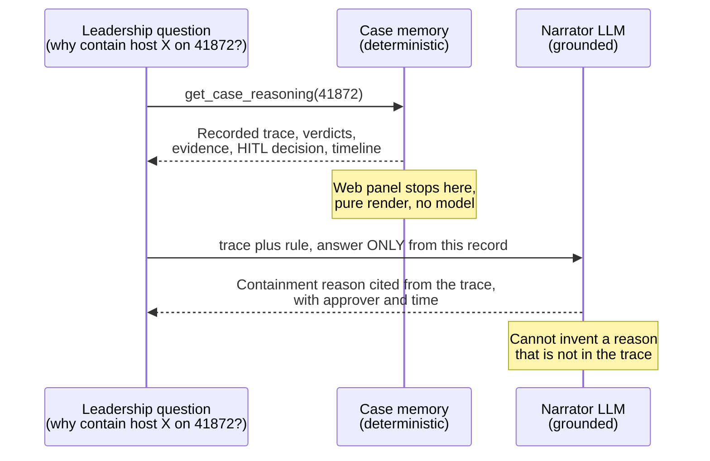

## TL;DR

[Last time](/posts/building-soc-in-a-box/) we built the org chart: one local LLM wearing eight analyst hats, coordinated over a Redis Streams bus, with a human-in-the-loop gate before any real-system action. It was fast. It was also **amnesiac** — every alert was the first alert it had ever seen.

This post adds the thing that separates a senior analyst from a fast one: **memory**. Not a vector store bolted on the side — a read projection over the event log the SOC was already writing. Four capabilities fall out of it:

<table>
<tr>
<td align="center" width="25%"><h3>🧠 Recall</h3>Agents pull similar prior cases as precedent before they decide — gated behind a flag so we can A/B it</td>
<td align="center" width="25%"><h3>📊 Proof</h3>Every verdict scored against analyst-curated ground truth — per-role accuracy, published, not hidden</td>
<td align="center" width="25%"><h3>🔍 Interrogation</h3>"Why did the IR Lead contain that host?" answered from the recorded trace, never a fresh rationalization</td>
<td align="center" width="25%"><h3>🛰️ Campaigns</h3>Cross-incident clustering on shared infra — the view no single ticket reveals</td>
</tr>
</table>

The interesting part isn't that an agent can remember. It's that once you can remember, you can **measure** — and once you measure, you have to be honest about whether the clever idea actually worked. That honesty is the whole post.

## The problem: a SOC's value is its memory

Watch a strong Tier 3 analyst work an alert and the magic isn't speed. It's the half-sentence they drop two minutes in: *"this is the third box this week phoning the same C2 — that's not commodity, that's the campaign from the Tuesday tipper."* That sentence is institutional memory doing the heavy lifting. Nobody on the floor wrote it down; it lives in the analyst's head and walks out the door when they take PTO.

v1 of the AI SOC reproduced the analyst's **reflexes** — triage, escalate, attribute, plan — but none of the **memory**. Each agent re-derived the world from a single ticket. It would dutifully attribute the same actor for the fifth time that week and never notice it was the fifth time. It had no answer to "have we seen this before?" because it had no past tense.

The gap is exactly the gap between a junior who is quick and a principal who is *right* — and right faster because they've seen it.

## The unlock: memory is a read model, not a new database

Here's the part I'd want a hiring manager to notice, because it's the difference between a feature and an architecture.

We didn't add a memory system. The event-sourced design from v1 was *already recording everything we needed* — we just hadn't been reading it as memory. Every role already persisted its verdict to a `verdicts.sqlite` sidecar with the reason, confidence, evidence, tool calls, and wall time. Every human approval already landed in `hitl.sqlite` with who decided and why. The `soc.audit` stream already mirrored every event for replay.

> 💡 **The payoff of event-sourcing shows up a release later.** When your system of record is an append-only log of what happened, "memory" is a *query*, not a migration. Case memory is a read projection — it adds a `case_memory.sqlite` index over events that already existed and a set of pure read functions over it. No agent had to change how it writes. That's the whole reason the first post obsessed over the bus shape instead of the prompts.
{: .prompt-tip }

So the memory layer is small and boring on purpose: an indexer that folds the audit stream into a per-case record, and a handful of read functions — `compute_trends`, `get_case_reasoning`, `find_campaign_clusters`, `recall_similar`. Everything below is built on those four reads.

## Recall: agents that cite precedent

The first capability is the obvious one: before an agent decides, let it see the cases it's already worked that look like this one.

"Look like this one" is the load-bearing phrase, and I want to be specific about how we resist the temptation to over-engineer it. Similarity here is **shared strong indicators** — the same actor, named campaign, file hash, domain, IP, or CVE appearing across cases. That's it. We don't embed the ticket and do cosine similarity on prose; a SOC case isn't a paragraph, it's a bag of hard indicators, and two cases that share a C2 domain are related in a way no embedding distance improves on. When a match exists, the prior case's verdict and reasoning get injected into the agent's prompt as **precedent it can weigh** — not a rule that forces a verdict.

A detail that matters to me: we let the LLM decide whether the precedent is relevant. The recall layer's job is retrieval — surface the candidate cases. The *judgment* of "is this actually the same thing, or a coincidence of one shared IP?" stays with the model, in the prompt, where it belongs. Hand-coding a relevance classifier on top of a model that already reasons about relevance is how you end up maintaining a brittle pile of `if` statements that fights the agent. Retrieve mechanically; judge semantically.

## Proof: does precedent actually make the agents better?

This is where most "we added memory to our agents" posts stop — at the demo where the agent says something that sounds smarter. I think that's the exact moment you're obligated to get suspicious of your own feature.

Precedent injection is a hypothesis: *agents that see prior cases make better calls.* It is not self-evidently true. It could just as easily anchor an agent on a stale verdict, or teach it to over-escalate because last week's similar case escalated. The only honest way to ship it is to make it **measurable and reversible**.

**Measurable.** Every agent verdict already carries a `ground_truth` field in backtest — sourced from the same analyst-curated escalation labels the [v1 backtest harness](/posts/building-soc-in-a-box/) used (32K+ historical tickets, each marked by whether a human actually escalated it). So per-role accuracy isn't a vibe: for each role we count verdicts that matched the human outcome over verdicts that had a ground-truth label, and render it as a card on the page — green when the role is pulling its weight, red when it isn't, honest "no labels yet → run the backtest" when we can't claim anything.

**Reversible.** Precedent recall sits behind a feature flag. Flip it off and the agents run baseline; flip it on and they get memory. Same harness, same tickets, two accuracy numbers. That's an A/B, not an assertion — and it means the answer to "did memory help the IR Lead?" is a delta we can read, including the delta being *negative* and us turning it back off.

> ⚠️ **Publishing your own agents' accuracy is a feature, not a confession.** The page shows a per-role accuracy card *and* a status strip that says, plainly, whether precedent recall is currently ON or OFF — so what a leader sees always matches how the agents are actually running. A dashboard that can only ever show good numbers is marketing. One that will show you a role at 48% is an instrument. Build the instrument.
{: .prompt-warning }

## Interrogation: explain the decision from the record, not from the model's imagination

Now the capability I'm most proud of, because it's a genuine safety problem dressed as a UX feature.

Leadership's most natural question about an autonomous system is *"why did it do that?"* — "why did the IR Lead propose containing that host on case 41872?" The naive implementation is to hand the ticket back to an LLM and ask it to explain. **That is the single most dangerous thing you can do.** A model asked to justify a past decision will produce a fluent, plausible, confident rationale — and it has every incentive to invent a *better* reason than the one the agent actually used at the time. You'd be replacing an audit trail with a generated alibi.

So Case Interrogation is built on a hard split:

- **Recall is deterministic.** Looking up case 41872 returns the *recorded* trace — each role's actual verdict, the actual confidence, the actual evidence it cited, the actual human who approved the action and the actual reason they gave, on a real timeline. No model runs on that lookup. It's a database read rendered to the page. If it isn't in the record, it doesn't appear.
- **Narration is grounded and constrained.** When you *do* want prose — the chat surface where you ask in natural language — the LLM is handed the recorded trace as authoritative context with one instruction: answer **only** from this record, cite the role and its recorded reason, and if the record doesn't say, say so. The model is a narrator of facts it's not allowed to add to, not an author of new ones.

The principle generalizes well beyond a SOC: **an agent explaining its own past behavior must never be allowed to sound smarter than it actually was.** Separate the retrieval of what happened (must be exact) from the explanation of it (may be fluent, must be grounded). Conflate them and your "explainability" feature is a confabulation engine.

## Campaigns: the view no single ticket gives you

The last capability is the one that turns memory from per-case into cross-case. An analyst working one ticket sees one ticket. Even a perfect agent working one ticket, perfectly, sees one ticket. Nobody is positioned to notice that *four* cases this week share the same C2 domain — because the structure of SOC work is one-analyst-one-alert.

Campaign Radar runs over the case index and clusters cases on shared strong indicators. When several cases rendezvous on the same actor, named campaign, hash, or domain, it surfaces them as **one campaign** with the shared infra, the member tickets, and a suggested hunt — advisory and read-only, a card that says "these four look like one thing, go look," not an action it takes itself. It's the same shared-indicator similarity that powers recall, pointed sideways across the whole window instead of backward from one case.

This is memory paying a dividend the original analysts couldn't, structurally, ever collect — and it's the clearest example of why an AI SOC is worth building even when individual agents are no smarter than a good analyst. The agent's edge isn't IQ. It's that it can hold every case in the window in its head at once.

## Outcome Trends: the rollup leadership actually asked for

Stitch the reads together over a window (7 / 30 / 90 days) and you get the leadership view: cases worked, the verdict/severity/disposition mix, the recurring actors and indicators across cases, the human approval rate, the per-role accuracy, and — the one nobody asks for until they see it — the **LLM token cost broken out per role**. The agents that cost the most tokens and the agents that score the highest accuracy are not always the same agents, and that gap is a roadmap.

It's the difference between "we have an AI SOC" and "here's how the AI SOC did this month, per role, against ground truth, at this cost." One is a press release. The other is something you can run a program on.

## What's reusable

If you're building agents that need a past tense, the transferable ideas aren't in any single panel:

- **Memory is a read model over your event log.** If your agents already emit structured events, "give them memory" is a query layer, not a new datastore. If they don't — that's the thing to fix first. Event-sourcing is the feature that keeps paying.
- **Retrieve mechanically, judge semantically.** Surface precedent by hard indicators; let the model decide relevance. Don't hand-code a classifier in front of a model that already classifies.
- **Ship the instrument that can embarrass you.** Score agents against ground truth and put the number on the page, red bands and all. Flag-gate the clever idea so "did it help?" is a measured delta you can also answer with *no*.
- **Split recall from narration.** Deterministic lookup for what happened; grounded, citation-only LLM for explaining it. Never let an agent author a nicer reason than the one it used.
- **Point similarity sideways.** The same case-matching that gives one agent precedent gives the whole SOC campaign detection — the cross-incident view that no single-ticket workflow can produce.

The v1 post ended on "the bus shape is worth more than any one agent." A release later, the bus shape is what made memory a weekend instead of a rewrite. The code lives in the public mirror at [`src/components/soc_in_box/`](https://github.com/vinayvobbili/security-ops-platform) — case memory index, the read functions, the web panels, all of it — and the failover brain underneath is still the open-source [`langchain-failover`](https://pypi.org/project/langchain-failover/).

**What's next:** promote per-role accuracy to a regression gate so a precedent change that *drops* a role's accuracy fails the build, and feed confirmed campaigns back to the Threat Hunter as standing hunt hypotheses — closing the loop from "we noticed a campaign" to "we went and found the rest of it." Memory was the prerequisite. Now the agents get to use it.
