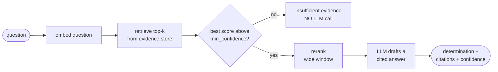

## TL;DR 🚀

I shipped [**attestq**](https://pypi.org/project/attestq/) to PyPI — a small, model-agnostic RAG kernel for a problem every security and GRC program has: you hold a **questionnaire** (a vendor security review, a SIG/CAIQ response, an audit-evidence request, a due-diligence form, the security section of an RFP) and a **pile of evidence** (SOC 2 reports, policies, standards, prior questionnaires). attestq retrieves the relevant evidence per question and drafts a grounded, **cited** answer — and, crucially, tells you plainly when the evidence isn't there instead of inventing one. 🧾

<table>
<tr>
<td align="center" width="33%"><h2>0 deps</h2><sub>pure-stdlib core — bring your own model, embedder, store</sub></td>
<td align="center" width="33%"><h2>1 gate</h2><sub>weak evidence &rarr; <em>insufficient evidence</em>, no LLM call</sub></td>
<td align="center" width="33%"><h2>2 tools</h2><sub>extracted from two production systems, now one kernel</sub></td>
</tr>
</table>

This is the GRC sibling of my earlier OSS work — [iocflow](/posts/iocflow-agentic-ioc-lifecycle/) for the IOC lifecycle and [detflow](/posts/detflow-detection-engineering-copilot/) for detection engineering. Same instinct: a pattern kept getting hand-rolled inside production tools, so I pulled the durable part out, made it boring and testable, and put it on PyPI. 🧰

## The failure mode nobody talks about

If you've ever automated questionnaire answering with an LLM, you know the naive recipe: chunk the docs, embed them, retrieve per question, prompt the model, paste into the form. It demos beautifully. Then it does this:

> **Q:** Do you encrypt customer data at rest with a customer-managed key?
> **A (the LLM):** Yes. Customer data at rest is encrypted using AES-256 with customer-managed keys rotated every 90 days.

…except none of your evidence says that. The corpus had encryption-at-rest, the model pattern-matched the *shape* of a good answer, and it filled in the customer-managed-key and 90-day-rotation details from its training prior. In a vendor security review or an audit response, **a confident wrong answer is worse than no answer** — it's the thing that gets walked back in front of an auditor.

The fix isn't a better prompt. It's accepting that **absence of evidence is a valid, first-class result**, and building the pipeline so the model never gets the chance to paper over it.

## The two fixes attestq bakes in

### 1. A confidence gate that runs *before* the LLM

attestq retrieves first, scores the best-matching evidence, and **if that score is below `min_confidence`, it returns an "insufficient evidence" answer without ever calling the model.** No prompt, no token spend, no opportunity to hallucinate. The determination you get back is your configured "absence" outcome (e.g. `Not Met`), with a standardized note explaining the evidence wasn't found.



The gate keys on the **retrieval** score — the raw cosine similarity from your embedder, before reranking — so the threshold stays calibrated to a stable scale no matter what reranker you bolt on. (A cross-encoder reorders relevance; it doesn't produce a comparable absolute confidence. Gating on the retrieval score keeps your one tuned number, `min_confidence`, meaningful.)

### 2. A wide rerank window so the right doc survives

The other naive-RAG bug is subtler: you retrieve a handful of chunks, rerank, keep the top 3 — and on a small or lopsided corpus, the single focused document that actually answered the question gets shoved out of the window by a cluster of vaguely-related ones. attestq keeps a deliberately generous post-rerank window (`rerank_top_k`) so a lone relevant chunk isn't dropped. This was a real bug in the production tool before extraction; it's now a default.

## Bring your own everything

attestq owns the *orchestration* — retrieve, gate, rerank, draft, cite. It owns **nothing** about which model, embedder, or vector store you use. You inject those as plain callables and protocols, so the core has zero third-party dependencies and the package never drags in a stack you didn't ask for.

```python
from attestq import Engine, Question

# Bring your own model + embedder — one-liners around any provider.
def my_chat(prompt: str) -> str:
    ...   # OpenAI, Anthropic, a local model, your corporate gateway, anything

def my_embed(texts):
    ...   # return one vector per text

engine = Engine(chat=my_chat, embed=my_embed)   # in-memory store by default

# Ingest a vendor's evidence into its own namespace.
engine.ingest(
    [
        ("All customer data at rest is encrypted with AES-256.", {"source": "DataProtection.pdf"}),
        ("MFA is enforced for all privileged access.",          {"source": "AccessControl.docx"}),
    ],
    namespace="helios",
)

ans = engine.evaluate(
    Question(
        id="ENC-1",
        prompt="Is customer data encrypted at rest?",
        choices=["Met", "Not Met", "Not Applicable"],
    ),
    namespace="helios",
)

print(ans.determination)          # "Met"
print(ans.confidence)             # 0.0 - 1.0 retrieval confidence
print(ans.insufficient_evidence)  # False
for c in ans.citations:
    print(c.source, "->", c.snippet)
```

Heavier capabilities ride on opt-in extras, each lazily imported so a missing one fails with a friendly "pip install attestq[x]" rather than an import error halfway through a run:

- `attestq[chroma]` — a persistent Chroma vector store over an existing collection
- `attestq[openai]` — an OpenAI-compatible chat + embedding adapter (any `base_url`)
- `attestq[ollama]` — local Ollama embeddings and chat, nothing leaves the host
- `attestq[rerank]` — a cross-encoder reranker (score-normalized so the gate stays valid)
- `attestq[loaders]` — pdf / docx / xlsx → ingestible chunks
- `attestq[all]` — everything

The `namespace` argument is the GRC-specific bit: vendor questionnaires need **per-vendor evidence isolation**, not one shared corpus. Each vendor's docs live under their own namespace, and retrieval filters on it — so Acme's SOC 2 can never bleed into Helios's answers.

## Try it in ten seconds, no model required

A built-in `HashEmbedder` needs no model and no service, so you can watch the retrieval pipeline and the confidence gate work the instant you install — then swap in a real provider when you're ready.

```bash
pip install attestq
attestq demo -o report.md          # runs a bundled fictional sample end-to-end
```

Point it at your own questionnaire and evidence folder, with any provider resolved from flags or environment:

```bash
attestq run -q questionnaire.yaml -e ./vendor-evidence -n acme -o report.docx
attestq demo --provider ollama     # local, no key, nothing leaves the host
```

## Where it came from (and why I trust it)

attestq isn't a greenfield toy. It's the distilled kernel of two tools I built and run in production:

- a **third-party / vendor cyber due-diligence assistant** that drafts a due-diligence form from a vendor's uploaded evidence, per-vendor, and
- a **customer-assurance drafter** that answers inbound customer security questionnaires from our internal policy corpus.

Both were independently solving the same retrieve → rerank → gate → cited-draft problem, and quietly drifting apart. Extracting the shared kernel — and then **refactoring the production tool to consume the public package** instead of its own copy — means the open-source version is the one under real load, not a sanitized fork. The dogfooding is the point: the same code that ships to PyPI is the code answering real questionnaires.

If you've read my [three phases of RAG quality](/posts/three-phases-of-rag-quality/) post, attestq is what the "grounding" phase looks like when you take it seriously enough to let the system say *no*.

## Why build it this way

The honest lesson across iocflow, detflow, and now attestq is the same: **the valuable, durable part of an AI system is usually the boring scaffolding around the model, not the model call itself.** Here that scaffolding is one decision — *don't let the LLM answer a question your evidence can't support* — turned into a default you can't forget to apply.

`pip install attestq`, bring your own model, and let it tell you when you don't have the evidence. 🔍

- **PyPI:** [pypi.org/project/attestq](https://pypi.org/project/attestq/)
- **Source:** [github.com/vinayvobbili/attestq](https://github.com/vinayvobbili/attestq)
