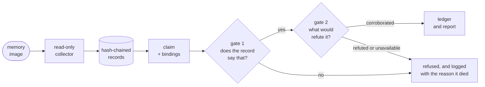

## TL;DR 🧾

In June I submitted [find-evil](https://vinayvobbili.github.io/posts/find-evil-self-correcting-dfir-agent/) to the SANS **FIND EVIL!** hackathon — an IOC-lifecycle layer that catches a forensic agent's hallucinated indicators. It didn't win. Reading the entries that placed, the ones I looked at had reached for the same defence I had: **put a second language model in front of the first and have it argue.** That is the part I now think is wrong, and [**witness**](https://github.com/vinayvobbili/witness) is the rebuild — same problem, an oracle that cannot be talked round.

<div class="tldr-cards cols-4">
<div class="tldr-card"><span class="tldr-num">0 LLMs</span><span class="tldr-sub">in the gate itself — a field comparison in plain Python, not a second opinion</span></div>
<div class="tldr-card"><span class="tldr-num">1,083</span><span class="tldr-sub">claims scored both ways: 100% precision, 100% recall, and every refusal named the actual defect</span></div>
<div class="tldr-card"><span class="tldr-num">119</span><span class="tldr-sub">crafted attacks against it — writing them found 7 real defects, all fixed</span></div>
<div class="tldr-card"><span class="tldr-num">1 command</span><span class="tldr-sub">clone and run: no install, no API key, no 3 GB memory image</span></div>
</div>

---

## The failure mode is not what people expect

Autonomous forensics agents do not usually fail by missing evil. They fail by **inventing** it.

A transposed octet in an IP address. A defanged domain read back wrong. A benign LOLBin called malware because it appeared in a suspicious-looking parent chain. A kernel driver called a rootkit when it was the acquisition tool that took the image.

Every one of those is a sentence that reads beautifully in a report. Every one of them sends an incident responder somewhere real, to look for something that was never there. And the agent is not lying — it read fifty thousand lines of tool output and produced a summary, and a summary is exactly the operation during which a specific value quietly becomes a plausible value.

That is the problem I entered the hackathon to solve, and I still think it is the right problem.

## Why a second model is the wrong oracle

The instinct is obvious and I had it too: if the agent might be wrong, add a checker. Give the checker the same evidence and ask whether the finding holds.

Here is what bothers me about it. **A language model can be argued out of a correct refutation.** Not through anything exotic — just the ordinary dynamics of a long context, a confidently worded claim, and a checker that has been trained to be agreeable. The checker starts out right and ends up persuaded. You have added a second thing that can be wrong and told yourself you added a guarantee.

There is a second problem, quieter and worse. A model-checked pipeline has no *stable* answer. Run it twice on the same evidence and you can get two verdicts, which means the report is not a fact about the case — it is a fact about that run. In forensics, where somebody may have to defend a finding a year later, that is close to disqualifying.

So the rule in witness is narrow enough to be boring:

> A finding is admitted only if a deterministic check confirms that the cited tool output really says what the claim says it says.
{: .prompt-tip }

No flag overrides it. There is no `--force`, no confidence threshold, no "the model was pretty sure." That is not asceticism; it is the whole product. A gate with an override is a suggestion.

## Gate 1: bind the field, not the document

Every claim carries **bindings** — *record R, field F, has value V*. Before anything is written, a pure-Python verifier re-reads R out of the store and compares F to V.





The nearest published approach to this requires a finding to cite a real tool-call ID. That is a genuine improvement over nothing, and it passes an agent that cites a real `psscan` run and then misstates what row 12 said. Provenance is not accuracy. The citation being real does not make the quotation real.

On the SANS `base-wkstn-05` image, the true kill chain is `WmiPrvSE.exe` (2676) spawning `powershell.exe` (3920), spawning `powershell.exe` (1332), spawning `rundll32.exe` (3720). Submitted with all six links bound, it is **admitted**.

Change one digit — claim the parent was 1233 instead of 1332 — and it is **refused**, against a record that genuinely exists, cited through a tool call that genuinely ran. That single case is the argument for field-level binding in one line.

My favourite rejection is subtler. Claim `subject_srv.exe` and the tool emitted `subject_srv.ex`. Volatility truncates `ImageFileName` at the fourteen bytes the kernel structure actually holds, so the fuller name is an **inference**, not evidence. The gate refuses it and says exactly that, so the agent can rebind to what the tool emitted instead of guessing at what it meant.

## Gate 2: what would prove this wrong, and did anyone look?

Quoting the evidence perfectly and drawing the wrong conclusion from it is the harder failure, and gate 1 does nothing about it.

So every finding type declares, up front, the evidence that would refute it — as a query or a predicate, never as a second opinion. Three outcomes, and the third is the one that matters:

- **Corroborated** — the refuting evidence was looked for and is not there.
- **Refuted** — the tool ran and shows the opposite. The claim dies and the attempt is logged.
- **Unavailable** — the tool that would settle it was never run. **This is not a pass.** The claim is held, and the agent is told which tool to run first.

On the clean baseline host, this claim has perfect bindings: *svchost.exe beaconed to external C2 at 172.16.4.10:8080*. The connection is real. The record says exactly this. Every field verifies.

`172.16.4.10` is RFC1918. It is proxy egress, not command and control. **Refuted** — and this is precisely the case that gate 1 alone waves through with a clean conscience.

That "unavailable is not a pass" line is the one I would defend hardest. It is the difference between a careful tool and a confident one, and it is the behaviour that most tools quietly get backwards: silence from a tool that never ran looks identical, in a report, to silence from a tool that ran and found nothing.

## Decode rather than describe

`FromBase64String("H4sIAAAA...")` in a carved command line is where an agent's confidence usually outruns its evidence. "A gzipped PowerShell stager, probably Empire, beaconing to some C2" is three guesses about bytes that simply **decode**.

So witness unwraps instead of characterising. It undoes base64 and gzip in the standard library, recurses into whatever that reveals, and writes the result as new records, each traceable back to the capture it came from. It names no framework and calls nothing malicious.

On that host the carve holds the same command line seven times at seven truncation lengths, which decodes to **one** payload rather than seven — the shorter captures stay in the store marked as prefixes of the longer one. That payload is gzip, and truncated, and says so. Inside it is a second base64 blob: 519 bytes of x86 that never was text. Inside *that* is a hostname.

`aaa.stage.9231829.extranet.wagonwheelgifts.com` — a DNS-beacon host embedded in second-stage shellcode, reachable only by decoding a carved command line twice. **My graded hackathon run never named it.** Decoding rather than describing found a C2 that reading the strings dump did not.

## The result I am proudest of is one it gets wrong

`www.venetodns.trade` is this intrusion's real command and control. witness **refuses** it.

In the exported captures that name appears in a raw string carve and in nothing that executed — and "found in the image" is not a tie to anything, since every domain in every email the user ever opened is also in that image. So the finding is held as unproven, and the refusal names the evidence that would settle it: ingest the PowerShell command line that carries the name, and the same claim is admitted.

Right on this evidence. A miss on this case. Both of those are true at once, and the report says so instead of splitting the difference.

I want to be plain about why that is in the post rather than buried. A tool that only ever shows you its wins has not told you where its edge is, and the edge is the only part that matters when you are deciding whether to trust it on evidence I have never seen.

## Getting the same report back

Nothing in the store is numbered from a clock or a counter. A tool-call ID comes from the tool, its arguments, and the hash of its output. A record ID comes from the call that emitted it. A finding ID comes from its type, claim, bindings and subject.

So the chain head is a **fingerprint of the case**, not of the run — and `witness replay` turns that from an argument into a command. It walks the chain of an existing store and performs every step again into an empty one: re-parsing each capture, re-running each analyser, re-submitting every finding **and every rejection** through both gates. Then it compares heads.

Two details worth pulling out. Captures are matched by hash, never by filename — rename every fixture and the case still replays; change one character and it matches nothing and is reported missing, rather than quietly replaying as itself under the name it used to have. And **the refusals replay too**, because a case that can only reproduce what it accepted has shown its conclusions are reproducible while leaving its refusals as assertions.

## What being careful costs

Most accuracy reports for tools like this take one case, state that no hallucinated finding survived, and stop. That number has no denominator. Nobody attempted a wrong claim, so nothing was resisted — and a tool that refuses everything scores identically.

So witness ships a corpus of **1,083 claims** whose truth is settled before the gate sees them: 519 the evidence supports, 564 it does not, across 29 classes of the way analysis actually goes wrong — a transposed PID, a name read one character short, the parent's PID asserted as the process's own, an RFC1918 peer called external C2, an injection claim on the host where nobody ran `malfind`.

- **precision 100%** — of 519 admitted findings, 519 were supported
- **recall 100%** — of 519 supported claims, 519 were admitted
- **reason 100%** — of 564 refusals, 564 named the actual defect

That third number is rare and it is the one that earned its keep. Of the claims it refused, how many refusals named the thing that is *actually* wrong, rather than a true statement about something else? Stopping the right claim for the wrong reason is luck, and luck does not repeat on the case you have not seen.

It started at 89.9%. Fifty-seven claims were being refused correctly and logged wrongly: their bindings verified, so the falsification checks ran — against a subject none of those bindings proved — and truthfully reported that no process exists with that PID. True, and about the wrong process. The fix orders cause before consequence: a binding that does not verify, then anything wrong with how the finding is assembled, and only then the checks. It cost nothing in accuracy, because the decisions were already right. It is the difference between a ledger that points at the claim and one that sends the next reader hunting a process that never existed.

Two rules keep that corpus from grading its own homework. Every claimed value is read off the captured tool output by a separate reader, never asked of the record it will be checked against — otherwise a parser that misread a column would generate a claim matching its own mistake and score full marks. And the census lines each raw row up with the record it became **by position**, so a row the collector dropped puts every later pair out of step and the run fails loudly rather than measuring one case fewer and still reporting a clean sweep. There is a test for that failing, because a harness that cannot fail is not measuring anything.

## What a hostile string in the image can make it say

A memory image is not trusted input. Everything in it was writable by whoever was on the box, and a good deal of it was written by the intruder on purpose. So the interesting question is not whether this works on honest evidence.

There are **119 crafted attacks** across nine families — text in the image that instructs the reader, bindings citing records that were never there, values that are almost the value, subjects the bindings never proved, hostile paths, decoder abuse, direct edits to the store, and payloads shaped to forge the report.

Writing them found seven real defects, all fixed rather than documented. Four are worth naming:

- **A gzip bomb in a carved string.** 194 KB of base64 in a `CommandLine=` inflated to 200 MB — 1.7 GB resident, half a minute of CPU, and a 200 MB row written into the store, from bytes an attacker chose to leave in the image.
- **A newline in an evidence path forged a Findings section.** The report is markdown built from strings an attacker controls, so a line break in any of them invented headings and displayed findings that were never admitted. That is this project's own failure mode appearing on the way *out* instead of on the way in, and it does not get a pass for that.
- **The chain could be cut.** Delete the last entries along with the rows they committed and what remains verifies perfectly, because a hash chain has no way to know how long it used to be.
- **`３７２０` in fullwidth digits compared equal to PID 3720**, because `\d` matches every decimal digit in Unicode. A homoglyph integer is not different in kind from a homoglyph domain.

## Run it

```bash
git clone https://github.com/vinayvobbili/witness && cd witness
python demo.py
```

Three seconds. No install, no API key, no 3 GB memory image, no network, no dependency outside the standard library. It loads both SANS hosts, puts seven claims through the gate, issues the report, then throws the case away and rebuilds it from the captures to the same hash.

Each of those seven declares what it expects **before** the gate is asked, and the run exits non-zero if any of them lands the other way. A demo that narrates whatever happened goes on looking impressive after the thing underneath it has broken — which is this project's own failure mode wearing a different hat, and it would be a strange thing to ship in a repository about refusing claims you cannot bind.

## Limits, stated rather than discovered later

- **Two hosts**, because two is what the SANS set exported — not because two is enough.
- **Memory only.** No MFT, no EVTX, no registry. Those collectors are unbuilt because there is nothing in the captured set to point them at, and a collector with no evidence behind it is a claim about coverage. It would have been easy to ship stubs and call it breadth.
- **Not one routable foreign address** exists in either host's connection table. So the admitting branch of the external-C2 predicate is exercised by unit tests rather than by this case. Refusing 168 internal peers called C2 is a real result about a real failure mode; it is not evidence that a true external C2 would be admitted.
- **1,083 is classes times records**, not 1,083 independent experiments. The per-class breakdown is in [`docs/ACCURACY.md`](https://github.com/vinayvobbili/witness/blob/main/docs/ACCURACY.md), which is the honest way to read the total.
- **The chain is re-verified on every submission**, so a thousand claims cost about thirty seconds and the cost grows with the square of the case. Fine at case scale; it wants an incremental check before it sees a large timeline.

---

If you take one thing from this: the useful question about an AI system that must not be wrong is not *how do I make it more careful?* It is **what is the smallest thing here that cannot be talked out of a correct answer, and can I put that in the path?** For this problem it turned out to be a field comparison, and it fits in a page of Python.

The repository is [github.com/vinayvobbili/witness](https://github.com/vinayvobbili/witness) — MIT, no dependencies, one command to see it work.
